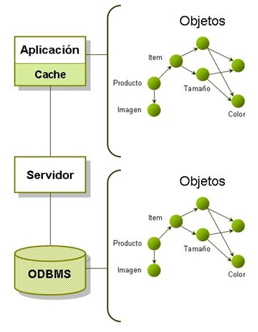

# DB4O – Database for objects

La base de dades DB4O va ser desenvolupada per Versant Corporation, una empresa amb seu a Redwood City, Califòrnia. Versant és un desenvolupador líder de tecnologia de base de dades dobjectes que recolza les iniciatives de base de dades comercials i de codi obert.

DB4O, és un motor de base de dades orientada a objectes, les sigles es corresponen amb l'expressió “DataBase 4 (for) Objects” aquest és un producte amb un alt rendiment més encara en mode embegut.

DB4O proposa un model de desenvolupament que proporciona a les aplicacions a la seva capa d'accés a dades un abandó complet del paradigma relacional de les bases de dades tradicionals. En efecte, deixa d'existir un llenguatge SQL de consultes o modificacions per passar a crear sistemes de consulta per mètodes delegats i actualització, creació, esborrament automàtic d'entitats mitjançant codi compilable.

No obstant això, aquest producte està impulsant algunes de les aplicacions més exigents del món per a companyies de diversos sectors com es mostra a continuació:

* ***Telecomunicacions***: Alcatel-Lucent, Deutsche Telecom, France Telecom, Ericsson, NEC, Nortel, Orange, Samsung, etc.
* ***Finances***: Financial Times, New York Stock Exchange, Dow Jones, Reuters, Londres Clearing House, Bank of America, etc.
* ***Transport***: Sabre, GE ferrocarrils, ferrocarrils BNS, Galileu, etc.
* ***Defensa***: Raytheon, Northrop Grumman, Lockheed, etc.
* ***Bioinformàtica***: May Clinic, St. Jude medical, Eidogen, etc.

Versant té per objectiu donar una opció als desenvolupadors distingeix denfocaments relacionals quan es tracta dobjecte persistència i així fer la seva vida més fàcil.

Aquesta tecnologia també és molt més econòmica que sistemes tradicionals bases de dades relacionals com Oracle, Sybase, SQL Server per esmentar-ne alguns. En efecte, els usuaris redueixen obtenen molts avantatges en leficiència en laccés a dades, menys dades dindexació, disseny simple, evitant el mapeig com en un ORM.
Emmagatzematge Directe DB4O



En aquest sentit, l'esquema de dades del domini és representat per la implementació que es realitzi del diagrama de classes. Per això, s'aconsegueix evitar el problema de l'Object Relational Impedance Mismatch sense sacrificar el rendiment que els ORM (Mapejat Objecte Relacional) pateixen actualment per dur a terme el mateix objectiu.

DB4O, té una llicència dual GPL/comercial que permet desenvolupar programari de codi obert i lliure.

En efecte, no comporta costs elevats com els gestors relacions tradicionals. No obstant això, si voleu aplicar a un programari privatiu, s'aplica un altre model de llicenciament concret.

## Característiques DB4O

La característica principal del DB4O és ser una base d'objectes nativa d'alt rendiment per a .Net o Java amb funció embeguda i remota. En efecte, podem citar vendes i desavantatges propis d'aquest gestor:

### Avantatges

Alt rendiment, velocitat de desenvolupament gràcies a la transparència que ofereix, baix consum de recursos, el fa ideal per a dispositius mòbils i entorns Clients/Servidor.

* Doble llicència GPL (Open Source) i llicència comercial que inclou suport.
* Documentació Clara, àmplia i ordenada. Orientada a exemples i de fàcil lectura.
* No hi ha mapeig entre objectes i taules.
* Característiques ACID (Atomicitat, Consistència, Aïllament, Durabilitat) que garanteixen lèxit de les transaccions.
* Maneres de treball Embegut i Client/Servidor.
* Codi d'accés a la base senzilla, entenedora d'acord amb el paradigma orientat a objectes.
* Millor rendiment amb objectes de negoci complexos (arbres, estructures imbricades, relacions N a N, relacions recursives)
* És possible realitzar de forma fàcil el Backup de la base de dades pel fet que aquesta es troba en un sol fitxer.
* Sistema de versió automàtic
* Les cerques es fan directament usant objectes, de la mateixa manera efectuar consultes és possible utilitzant QBE, (cerques comparant un objecte plantilla), Native Query (recerques natives) SODA Query API (cerques de baix nivell).
* Canvis en l'estructura de base de dades orientada a objectes com afegir o treure atributs a una classe s'apliquen directament a la base, sense haver de migrar dades ni fer reconfiguracions.
* Multiplataforma, a més de poder manejar-se nadivament a Java i .Net
* Ofereix un motor de base de dades embeguda per a dispositius mòbils en entorns OO

### Desavantatges

No hi ha un llenguatge de consultes similar a SQL aquestes tasques han de realitzar-se programàticament.

No hi ha restriccions, s'han de programar pel fet que no el gestor no implementa integritat referencial.

La mida de la base dades és teòricament és limitat a fitxers de 264GB, no obstant això es garanteix un accés fluid i eficient fins i tot amb fitxers de 10GB.

* No permet clustering.
* No hi ha una gestió de permisos.
* No teniu aplicacions per a data-mining ni informes o altres eines que estan presents en gestors relacionals.
* L'explotació de les dades existents s'ha de fer mitjançant altres mitjans.
* La concurrència d'usuaris fent la mateixa petició o executant el mateix procés és limitada a comparació d'altres gestors comercials.

### Aplicacions ideals per a DB4O

Anteriorment es van mostrar les bondats que té DB4O, però cal emfatitzar que té determinades limitants en cert tipus d'escenaris i en altres s'ajustaria idealment als requeriments.

En efecte, es pot utilitzar en una gamma de producció de programari educatiu, l'enfocament principal és en l'ús integrat o embegut de manera que la seva implementació en sistemes mòbils (telèfons i ordinadors de mà), electrònica de dispositius (impressores, cotxes, robots ), sistemes SCADA (Supervisory Control And Data Acquisition), poden resultar productives.

La taula següent ofereix les implementacions possibles i beneficis de la db4o a l'entorn determinat.

* ***Sistemes educatius***: El model orientat a objectes, conjuntament amb la interfície de programació és intuïtiu. Fan a DB4O una eina educativa ideal fàcil de fer servir i proporciona un exemple significatiu del món orientat a objectes. Més encara utilitzant nadivament leguatges orientat a objectes populars com Java i C# (. NET).
* ***Prototips***: L'ús del db4o per construir prototips de sistemes és molt més ràpid que usant un SGBDR. En cas de db4o, no cal crear un model de dades ni assignar el model d'objectes de la base de dades. El mecanisme de persistència general és transparent i requereix un mínim esforç per adaptar-se. La refactorització automàtica permet un canvi ràpid de les classes sense necessitat d'actualitzar la base de dades.
* ***SCADA***: L'ús de db4o en sistemes SCADA permet aconseguir un alt rendiment en l'emmagatzematge a la memòria cau i el maneig adequat d'esdeveniments. Un altre dels beneficis és la fàcil integració amb Java i llenguatges de programació. NET. db4o també es pot executar com una base de dades de memòria, proporcionant un millor rendiment minimitzant laccés al disc.
* ***Aplicacions Mòbils***: Les aplicacions mòbils aprofiten el mode embegut de BDOO on no requereix administració i es considera independent. La sincronització amb el servidor principal es pot fer amb lajuda de DRS2 (Replication System).La refactorització automàtica és un factor important, que permet saltar-se el treball d'actualitzar les bases de dades quan simplementa una nova versió del model d'objectes.
* ***Aplicacions***: El desenvolupament d'aplicacions web o d'escriptori és possible per la integració nativa amb els llenguatges ja esmentats, però cal emfatitzar que no es considera ideal per a projectes petits i considerats mitjans.
* ***Programació de dispositius***: Les aplicacions en dispositius que utilitzen DB4O gaudeixen dels mateixos beneficis que les aplicacions mòbils. La portabilitat i la mida mínima són la principal característica.
* ***Programari Open-Source***: DB4O té la llicència de codi obert GPL, sent compatible, nadiu de Java i net. S'integra fàcilment amb qualsevol producte de codi obert de Java i .NET.

No obstant això, és important fer notar que altres aplicacions poden no ser adequats per a DB4O. Per exemple, en situacions on hi ha quantitats creixents de dades (més de 10 Gigabytes) i alta concurrència (més de 20 usuaris concurrents/processos) juntament amb els seus models complexos la implementació no serà adequada, per la qual cosa serà millor buscar altres opcions.

En aquests casos, la base de dades orientada a objectes Versant és probablement una opció més apropiada. Les aplicacions client de VERSANT cobreixen un ampli espectre d'ús on s'exhibeixen milers de transaccions corrents (cents de milers de transaccions concurrents per segon) a centenars de gigabytes amb alguns clients. Suportant VERSANT 25 Terabytes a la base de dades.

Models simples com taules de registres o de models de dades complexes de dades poden ser millor recolzats per un RDBMS. En aquest cas, l'accés a dades ad hoc seria més important per aplicar-lo que casos d'ús definits utilitzant un model d'objectes.

## Escalabilitat de DB4O

DB4O és capaç d'utilitzar-se amb bases de dades molt grans de fins a 254 GB per arxiu de base de dades. No obstant això, això és inusual tenint com a regla general no esperar que la base de dades pugui créixer més enllà de 10 GB, en aquest cas és millor cercar altres opcions com Versant o ObjectDB.

També db4o no està dissenyat per a un accés altament concurrent major a 20 usuaris concurrents per procés en un entorn client/servidor malgrat permetre molts clients utilitzant dades al mateix temps.

# DB4O – Accés a Dades

L'accés a les dades a una base d'objectes és navegacional.

L'eficiència en velocitat és una de les característiques notables a SGBDOO, la mateixa es deu al fet que les referències són emmagatzemades directament a cada instància, mentre que a les bases de dades tradicionals l'accés és tabular. Es poden citar tres principals formes de fer consultes, cadascuna basada en una tecnologia diferent aquestes són:

* ***S.O.D.A.***: (Simple Object Database Access) / Accés Simple a Bases de Dades d'Objectes.

* ***Q.B.E.***: (Query By Example) / Consulta per Exemple o Plantilla.

* ***N.Q.***: (Native Queries) / Consultes Natives.

A la taula següent es mostra de forma detallada els avantatges i desavantatges de l'accés a dades que proposa DB4O.

| Tecnologia | Avantatges | Desavantatges |
|------------|------------|---------------|
| ***SODA*** | Simplicitat per fer consultes. Funcionalitats limitades no tenen consultes de conjunts (AND, NOT, OR). | Cal afegir un constructor per crear objectes sense camps inicialitzats. No es pot consultar per valors nuls. |
| ***QBE*** | Independència del llenguatge de programació utilitzat. | No es verifiquen tipus en temps de compilació. |
||API simple.  | Massa explícita.  |
||Minimitza l'ús de cadenes per a consultes  | Opera sobre camps, en comptes de propietats. |
||Opera sobre propietats  | Cal actualitzar les consultes quan es refactoritza o modifica el model de classes.  |
||Introdueix conceptes relacionats amb grafs de nodes (natural a les bases d'objectes): baixar i restringir per nodes que poden ser una o moltes classes, un atribut d'una classe o consultes mateixes | Consultes basades en cadenes embegudes són blanc per a atacs via injecció de codi. |
| ***NQs*** | Interfície recomanada per gestors orientats a objectes. | Les consultes han de ser traduïdes al llenguatge o API del motor, això pot penalitzar en rendiment en el cas de consulta complexes on no és possible fer-ho sense instànciar alguns objectes persistits. |
| | Seguretat en tipus de dades. | |
| | Verificació derrors semàntics i sintàctics en temps de compilació. | |
| | Capacitat de refactoritzar codi. | |
| | Consultes natives sense necessitat d'aprendre llenguatges de consultes o un API. | |

# DB4O – Creació d'estructures i manipulació bàsica de dades

L'accés a dades a un fitxer de base de dades DB4O existent o la creació del mateix, es realitza amb `Db4oEmbedded.openFile([nomDeLaBaseDeDatos])`, passant la ruta del fitxer de base de dades com a paràmetre; així obtenim una instància de `ObjectContainer` que serà la seva interfície primària a DB4O.

L'`ObjectContainer` és la interfície per accedir a la base de dades. Normalment hauríeu d'obrir un contenidor d'objectes quan s'iniciï l'aplicació, realitzar les operacions corresponents i tancar-la la connexió quan s'acaba el procés.


```java
ObjectContainer bd = Db4oEmbedded.openFile("databaseFile.db4o");
try {
  //TODO Aquí es pot utilitzar l'ObjectContainer (bd)
} finally {
  bd.close();
}
```

En efecte, és fonamental tancar el contenidor amb què es va procedir a obrir la base de dades per així alliberar tots els recursos associats a aquest. Per a la creació de l'estructura cal establir les classes i els atributs definits en el diagrama de classes.

En efecte, és fonamental tancar el contenedor amb el que es procedirà a obrir la base de dades per així alliberar tots els recursos associats al mateix. Per a la creació de l'estructura és necessari establir les classes i atributs definits en el diagrama de classes.

```java
public class Pilot {
  private String name;
  private String lastName;
  private int points;

  public Pilot(String name, String lastName, int points) {
    this.name = name;
    this.lastName = lastName;
    this.points = points;
  }

  public int getPoints() {
    return points;
  }

  public void addPoints(int points) {
    this.points += points;
  }

  public void setName(String name) {
    this.name = name;
  }

  public void setLastName(String lastName) {
    this.lastName = lastName;
  }

  public void setPoints(int points) {
    this.points = points;
  }

  public String getName() {
    return name;
  }

  public String getLastName() {
    return lastName;
  }

  public String toString() {
    return name + "-" + lastName + "/" + points;
  }
}
```

## Emmagatzematge d'objectes
Per emmagatzemar un objecte en un fitxer de base de dades del `DB4O`, s'utilitza el mètode `store()` passant l'objecte com un paràmetre perquè sigui persistit posteriorment.

```java
String DBOO_EJEM = "databaseFile.db4o";
ObjectContainer db = Db4oEmbedded.openFile(DBOO_EJEM);

// [storeFirstPilot]
Pilot pilot1 = new Pilot("Jaime","Gonzales", 99);
Pilot pilot2 = new Pilot("Pedro","Camacho", 70);
Pilot pilot3 = new Pilot("Ximena","Casas", 56);
Pilot pilot4 = new Pilot("Gabriela","Rios", 89);
Pilot pilot5 = new Pilot("Jorge","Villalobos", 92);
Pilot pilot6 = new Pilot("Gonzalo","Peredo", 72);
Pilot pilot7 = new Pilot("Daniel","Nina", 80);
Pilot pilot8 = new Pilot("Michael","Suarez", 85);
Pilot pilot9 = new Pilot("Maria","Garcia", 81);
Pilot pilot10 = new Pilot("Gonzalo","Martinez", 65);
Pilot pilot11 = new Pilot("Jhoana","Valle", 89);
Pilot pilot12 = new Pilot("Johnny","Plata", 74);
Pilot pilot13 = new Pilot("Ana","Sandoval", 78);
Pilot pilot14 = new Pilot("Luis","Pacheco", 69);
Pilot pilot15 = new Pilot("Gonzalo","Loza", 100);
try {
  db.store(pilot1);
  db.store(pilot2);
  db.store(pilot3);
  db.store(pilot4);
  db.store(pilot5);
  db.store(pilot6);
  db.store(pilot7);
  db.store(pilot8);
  db.store(pilot9);
  db.store(pilot10);
  db.store(pilot11);
  db.store(pilot12);
  db.store(pilot13);
  db.store(pilot14);
  db.store(pilot15);
} finally {
  db.close();
}
```

## Recuperar Objectes
Per realitzar consultes a `DB4O` hi ha diverses alternatives. Per això, a continuació es realitzarà el llistat dels pilots fent un Query.

```java
String DBOO_EJEM = "databaseFile.db4o";
ObjectContainer container = Db4oEmbedded.openFile(DBOO_EJEM);
try {
  List<Pilot> pilots = container.query(Pilot.class);
  for (Pilot pilot : pilots) {
    System.out.println(pilot);
  }
} finally {
  container.close();
}
```

En aquest sentit. Per fer una consulta a `DB4O` utilitzem `QBE` `(Query by Example)` que és una de les formes d'accés a dades. Això vol dir que crearem un objecte prototípic perquè el `DB4O` el faci servir com a exemple i pugui recuperar tots els objectes del tipus donat que continguin els mateixos valors que l'objecte candidat. El resultat serà manejat com una instància de l'`ObjectSet`, a l'exemple es mostraran tots els pilots que tinguin '100' punts.

```java
ObjectContainer container = Db4oEmbedded.openFile(DBOO_EJEM);
Pilot pilotoEjemplo=new Pilot(null,null,100);
try {
  List<Pilot> pilots = container.queryByExample(pilotoEjemplo);
  for (Pilot pilot : pilots) {
    System.out.println(pilot);
  }
} finally {
  container.close();
}
```

Una manera més completa per realitzar consultes és utilitzant `NQ` `Native Queries`, a l'exemple es mostraran tots els pilots de nom `Gonzalo`.

```java
ObjectContainer container = Db4oEmbedded.openFile(DBOO_EJEM);
try {
  List<Pilot> pilots = container.query(new Predicate<Pilot>() {
  public boolean match(Pilot o) {
    return o.getName().equals("Gonzalo");
  }
});

  for (Pilot pilot : pilots) {
    System.out.println(pilot);
  }
} finally {
  container.close();
}
```

Per recuperar els elements de la base de dades és possible també fer un `Query`, emmagatzemant els objectes en una col·lecció de manera que sigui més fàcil la manipulació.

## Actualitzar Objectes
Per actualitzar objectes emmagatzemats a la nostra base de dades, cal trucar al mètode `store()` passant com a paràmetre l'objecte modificat de la següent manera.

```java
ObjectContainer container=Db4oEmbedded.openFile("databaseFile.db4o");
try {
  List<Pilot> listaDePilotos = container.query(new Predicate<Pilot>() {
  public boolean match(Pilot o) {
    return o.getName().equals("Gonzalo") && o.getLastName().equals("Peredo");
  }
});

  Pilot aPilot = listaDePilotos.get(0);
  aPilot.setLastName("Perez");
  //update the pilot
  container.store(aPilot);
} finally {
  container.close();
}
```

En efecte, fer una actualització en un objecte de la base de dades necessita que `DB4O` conegui amb anterioritat l'objecte a modificar, d'una altra manera l'emmagatzemarà com un objecte nou. En aquest sentit, l'objecte ha de ser recuperat, després modificat i desat novament durant la sessió actual de DB4O.

## Eliminar Objectes
Per esborrar objectes de la base de dades primer cal trobar o identificar els objectes a esborrar i després només utilitza el mètode `delete()` com es mostra seguidament exemple on s'eliminés el pilot de nom `Gonzalo Perez`.

```java
ObjectContainer container = Db4oEmbedded.openFile("databaseFile.db4o");
try {
  List<Pilot> listaDePilotos = container.query(new Predicate<Pilot>() {
  public boolean match(Pilot o) {
    return o.getName().equals("Gonzalo") && o.getLastName().equals("Perez");
  }
});

  Pilot aPilot = listaDePilotos.get(0);
  container.delete(aPilot);
  System.out.println("Eliminant ... "+aPilot);
} finally {
  container.close();
}
```

# DB4O – Consultes simples QBE (Query By Example)

Hi ha diverses alternatives per recuperar objectes de `DB4O` utilitzant consulta `QBE` sent una alternativa és fàcil i intuïtiva, però, hi ha moltes situacions on no és suficient o simplement no poden ser expressades fàcilment.
En els següents exemples farem servir un mètode anomenat `ListResult(result)` per poder mostrar les dades.

```java
public static void listResult(List<?> result) {
  System.out.println(result.size());
  for (Object o : result) {
    System.out.println(o);
  }
}
```

## Consultes simples QBE (Query By Example)

Aquest mètode de consulta és fàcil d'usar, bàsicament consisteix a enviar com a paràmetre o objecte exemple o plantilla, el gestor cercarà a la base de dades tots els objectes similars on el valor dels atributs sigui igual a la de l'objecte exemple.
En aquest exemple es mostren tots els pilots de nom `Gonzalo`.

```java
Pilot theExample = new Pilot();
theExample.setName("Gonzalo");
ObjectSet result = container.queryByExample(theExample);
```

Mostrarem els pilots amb `70` punts i de cognom `Camacho`.

```java
Pilot theExample = new Pilot();
theExample.setLastName("Camacho");
theExample.setPoints(70);
ObjectSet result = container.queryByExample(theExample);
```

Per retornar tots els objectes de la mateixa classe podeu enviar un objecte buit o fer referència la classe. Com es mostra a continuació.

```java
Pilot example = new Pilot();
final ObjectSet result = container.queryByExample(example);
final ObjectSet result = container.queryByExample(Pilot.class);
```

Quan utilitzeu una consulta `QBE`, es proporciona un objecte plantilla a `DB4O` que retornarà tots els objectes que s'ajusten a tots els valors de camp no predeterminats. Això es fa a través del que reflecteix tots els camps i la construcció d'una expressió de consulta on tots els camps `no-default-valor` es reuneixen amb `AND` expressions. Tot i això, les consultes `QBE` d'aquesta manera tenen algunes limitacions:

* `DB4O` ha de reflectir tots els membres de l'exemple objecte donat.
* No es poden fer expressions de consulta avançades `(AND, OR, NOT, etc.)`.
* No es pot restringir en valors com `0`, `"" (cadenes buida)` o `nuls (tipus de referència)` perquè són interpretats com a restriccions.
* Cal un constructor per crear objectes sense camps inicialitzats.
* No obstant això, per solucionar aquestes limitacions, `DB4O` proveeix una altra manera de fer consultes amb un api anomenat `Native Query` `(NQ)`.

# DB4O – Consultes Natives NQ (Native Query)

Les consultes esteses s'integren a `DB4O` a causa de la necessitat de fer servir l'orientació a objectes per poder ser utilitzat pels mètodes dins de les consultes.

Per això, les consultes natives són la interfície principal de consultes `DB4O` i són la forma recomanada per consultar bases de dades des de laplicació. Atès que les consultes natives simplement fan servir la semàntica del seu llenguatge de programació, són perfectament normalitzada i una opció segura per al futur. Així mateix, les consultes natives estan disponibles per a totes les plataformes suportades per `DB4O`.

Les consultes natives treballen per convenció. S'espera que una classe que ampliï la classe `com.db4o.Predicate` per tenir un `mètode()` per coincidir amb un paràmetre booleà per descriure el grau de classe.

```java
List<Pilot> list = db.query(new Predicate <${extent}> () {
public boolean match(${extent} candidate){
  return true;
}
});
```
Seguint la convenció plantejada, en aquest exemple es mostraran els pilots de nom `Ximena`.

```java
ObjectSet result = container.query(new Predicate() {
  @Override
  public boolean match(Pilot pilot) {
    return pilot.getName().equals("Ximena");
  }
});
```

Amb aquesta consulta es mostraran es mostraran els pilots que tinguin una puntuació en un rang de `71` a `100`.

```java
ObjectSet result = container.query(new Predicate() {
  @Override
  public boolean match(Pilot pilot) {
    return pilot.getPoints() >=71 && pilot.getPoints() >=100;
  }
});
```

Aquesta forma de realitzar consultes són esteses i accessibles de manera que permeten realitzar consultes més específiques i personalitzades segons els requeriments que es tingui. Aquesta consulta mostres els pilots amb una puntuació més gran de `50` i que tinguin el cognom que comenci amb `C`.

```java
ObjectSet result = container.query(new Predicate() {
  @Override
  public boolean match(Pilot pilot) {
    return pilot.getPoints()>=51 && pilot.getLastName().charAt(0)=='C';
  }
});
```

Aquesta secció es consulten als pilots amb una puntuació en un rang entre `18` i `30` o que tinguin el nom `Gonzalo`.

```java
ObjectSet result = container.query(new Predicate() {
  @Override
  public boolean match(Pilot pilot) {
    return (pilot.getPoints() > 18 && pilot.getPoints() < 30) || pilot.getName().equals("Gonzalo");
  }
});
```

Mostra tots els pilots que tinguin els puntuacions `80, 20, 33, 55` o que el seu nom comenci amb `Jo`.

```java
final List puntos = Arrays.asList(80,20,33,55);
ObjectSet result = container.query(new Predicate() {
  @Override
  public boolean match(Pilot pilot) {
    return puntos.contains(pilot.getPoints()) ||
    pilot.getName().startsWith("Jo");
  }
});
```

Ordenar els pilots per ordre alfabètic, que tinguin puntuació més gran a 50.

```java
final ObjectSet pilots = container.query(new Predicate() {
  @Override
  public boolean match(Pilot o) {
    return o.getPoints() > 50;
  }
}, new QueryComparator() {
  public int compare(Pilot pilot, Pilot pilot1) {
    return pilot.getName().compareTo(pilot1.getName());
  }
});
```

Noteu en l'últim exemple que es tenen dos blocs, de codi, un per filtrar o realitzar la consulta dels pilots al `MATCH` i un altre bloc de codi denominat `COMPARE` que efectivament comparés els nostres registres filtrats sota un criteri personalitzat nostre. Això permetrà fer l'ordenació dels nostres registres.

# DB4O - Consultas complejas SODA

La API de consulta `SODA` es de consulta bajo nivel `API` de `DB4O`, permitiendo el acceso directo a los nodos de los grafos de la consulta. `SODA` utiliza cadenas para identificar los campos es bastante detallado de escribir.

```java
Query query = container.query();
query.constrain(Pilot.class);

ObjectSet result = query.execute();
listResult(result);
```

```java
Query query = container.query();
query.constrain(Pilot.class);
query.descend("points").constrain(new Integer(100));

ObjectSet result = query.execute();
listResult(result);
```

```java
Query query = db.query();
query.constrain(Pilot.class);
Query pointQuery = query.descend("points");

query.descend("name").constrain("Rubens Barrichello")
  .or(pointQuery.constrain(new Integer(99)).greater()
  .and(pointQuery.constrain(new Integer(199)).smaller()));

ObjectSet result = query.execute();
listResult(result);
```
