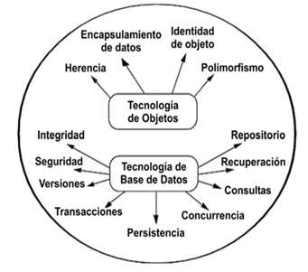
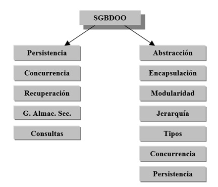

# Introducció a les Bases de Dades Orientades A Objectes

## Paradigma d'orientació a objectes

L'orientació a objectes és una metodologia de modelatge i desenvolupament basada en conceptes orientats a objectes (OO). En aquest sentit defineix un conjunt de principis de disseny i desenvolupament basats en estructures de computadores conceptualment autònomes conegudes com a objectes.

L'orientació a objectes s'acobla a la simulació de situacions del món real. A Programació Orientada a Objectes (POO), les entitats centrals són els objectes, que són tipus de dades que encapsulen amb el mateix nom estructures de dades i les operacions o algorismes que manipulen aquestes dades [Joyanes, 1996].

En efecte, cada objecte representa una entitat del món real amb la capacitat d'actuar amb si mateixa i d'interactuar amb altres objectes.

## Bases de dades orientades a objectes

En una base de dades orientada a objectes, la informació es representa mitjançant objectes, però s'integren característiques d'una base de dades amb principis del paradigma orientat a objectes.

Un objectiu de les bases de dades orientades a objectes és mantenir una correspondència directa entre els objectes del món real i de la base de dades [Elmasri & Navathe, 2007].

En aquest sentit, considerant i tenint en compte aquest concepte, les bases de dades orientades a objectes (BDOO) estan dissenyades per capturar les dades d'un sistema de negoci, per això poden ser considerats com un conjunt d'objectes que interactuen entre si.

Una base de dades orientada a objectes és una col·lecció d'objectes on el seu estat, comportament i relacions són definits d'acord amb un model de dades orientat a objectes [Kim, 1991].

Un sistema gestor de base de dades orientada a objectes (SGBDOO) permeten que la manipulació, maneig de la informació mitjançant objectes resguardant la informació amb objectes persistents de forma transparent, amb un control de concurrència, recuperació de dades, consultes associatives, integració directa amb llenguatges de programació orientat a objectes i altres capacitats pròpies del paradigma orientat a objectes.

# Model de Dades Orientades a Objectes

En la programació orientada a objectes les entitats centrals són les dades anomenades objectes però cal considerar que és una extensió del paradigma de programació orientat a objectes.

Els objectes entitat que s'utilitzen als programes orientats a objectes són anàlogues a les entitats que s'utilitzen a les bases de dades orientades a objectes, però amb una gran diferència:

Els objectes del programa desapareixen quan el programa acaba la seva execució, mentre que els objectes de la base de dades romanen a això se li denomina persistència.

No obstant això, cal conèixer els següents conceptes del paradigma orientat a objectes.

## Classe

En el model orientat a objectes es classifiquen els objectes segons les semblances i les diferències. En efecte, els objectes que comparteixen característiques comunes s'agrupen en classes.

Una classe és una col·lecció d'objectes similars amb estructura compartida (atributs) i comportament (mètodes) [Rob & Coronel, 2007].

Una classe és una especificació del comportament abstracte dun tipus dobjecte. Les classes són instanciables per la qual cosa es poden crear instàncies d'objectes individuals [Martin & Medarde, 2003].

La classe descriu i implementa tots els mètodes que capturen el comportament de les seves instàncies. La implementació està totalment oculta (encapsulada) dins de la classe, de manera que pot ser estesa i medicada sense afectar lusuari. En efecte, els objectes que comparteixen el mateix conjunt d'atributs i mètodes s'agrupen a classes.

## Objecte
Un objecte és la instància duna classe, els objectes es comuniquen entre si mitjançant lús de missatges i el conjunt dobjectes que responen als mateixos missatges simplementen mitjançant classes.

Un objecte és una representació abstracta d'una entitat del món real que té una identitat única, amb l'habilitat d'interactuar amb altres objectes i amb ells mateixos[Rob & Coronel, 2007].

Un objecte té un comportament, herència i encapsulament. Permetent que aquestes característiques siguin més naturals que el model relacional on sovint s'obliguen el dissenyador a crear entitats noves artificials que representen entitats reals.

Al model orientat a objectes s'identifiquen dos tipus d'objectes:

### Objecte transitori
Els objectes en un llenguatge de programació orientat a objectes només existeixen durant lexecució del programa; per tant, s'anomenen objectes transitoris.

### Objecte persistent
En una BDOO podeu estendre l'existència dels objectes guardant-los permanentment, de manera que els objectes persisteixen més enllà de la terminació del programa, es poden recuperar i compartir amb posterioritat amb altres programes. Les bases de dades orientades a objectes emmagatzemen objectes persistents permanentment en emmagatzematge secundari, i permeten que es puguin compartir entre diversos programes i aplicacions.

### Objecte Complex
Segons Bertino, un objectes complex és conjunt d'atributs (o variables d'instància o slots), està associat a cada objecte; el valor d‟un atribut pot ser un objecte o un conjunt d‟objectes. Aquesta Característica permet definir objectes arbitràriament complexos en termes d'altres objectes [Bertino & Martino, 1995].

En aquest sentit, un objecte compost s'obté agregant o agrupant objectes. La conveniència dels objectes compostos ve imposada per dues raons principals: el seu ús com la base per al clúster físic i el seu ús per realitzar operacions basant-se en l'abstracció de l'objecte complex. Quan un objecte compost s'esborra o copia el SGBDOO pot automàticament esborrar o copiar tots els objectes components.

## Identitat de l'objecte (OID)
Un sistema gestor de bases de dades orientat a objectes proporciona una identitat única a cada objecte independent emmagatzemat a la base de dades anomenada OID.

Cada objecte té un identificador d'objecte únic dins del domini d'emmagatzematge de l'objecte, que és l'OID generat per SGBD (Sistema Gestor de Base de Dades) que no canvia i que no es reutilitza quan l'objecte s'esborra [Martin & Medarde, 2003 ].

Anàlogament pot ser comparada amb el model relacional, en el qual cada relació ha de tenir un atribut de clau principal el valor del qual identifiqui de forma única cada tupla, però el valor d'un OID no és visible per a l'usuari extern, sinó que sistema lutilitza a nivell intern per identificar cada objecte de manera única per crear i administrar les referències entre objectes.

## Propietats

Els objectes que són creats són descrits pels seus atributs, els mateixos són coneguts com a variables d'instància en un ambient OO. En efecte, cada tribut té un nom únic i un tipus de dades que hi estan associades, els atributs tenen un domini, el mateix agrupa i descriu lògicament el conjunt de tots els valors que pot tenir atribut.

L'atribut d'un objecte pot tenir un valor únic o valors múltiples, així mateix els atributs d'objectes poden fer referència a un o més objectes.

Això no obstant, es defineixen dos tipus de propietats atributs i relacions.

En un SGBDOO proporciona la possibilitat que els atributs dels objectes tractats siguin simples o complexos. Els atributs simples són aquells que prenen valors literals (sencer, cadena, decimal, booleà, etc.). Tot i això, els atributs complexos poden ser de tres tipus:

## Referències

Són aquella que es fan servir per representar relacions entre objectes.
Col·leccions

Es poden ser llistes, mapes, conjunts o arrays de valors (simples o referències). Aquestes col·leccions solen tenir una gran quantitat d'elements, i per això la majoria dels SGDBOO recorren a iteradors, que proporcionen al programa els elements sol·licitats i permeten a més a més bloquejar les dades en ús actualment, i no la col·lecció completa.

## Derivats

Poden ser definits proceduralment en comptes de ser emmagatzemats explícitament. Aquests atributs no solen emprar-se en els llenguatges on la sintaxi per referir-se a un atribut és diferent de l'empleada per invocar un mètode o funció. En alguns sistemes els literals són considerats com a objectes i poden ser tractats sintàcticament i semànticament com ells.

## Operacions

Es defineixen com:

Els procediments i funcions, anomenats mètodes o funcions membre, resideixen a l'objecte i determinen com actuen els objectes quan reben un missatge [Joyanes, 1996].

Els SGBDOO deuen llavors, a diferència dels SGBDR, proporcionar un mecanisme per a l'emmagatzematge i l'execució de mètodes. Als SGBDOO hi ha dues opcions per al maneig o registre de mètodes:

### Emmagatzemar els mètodes en fitxers externs

Els procediments són emmagatzemats emprant els fitxers d'un llenguatge de programació convencional, aquests mateixos estan associats simplement amb les classes per les declaracions als programes dels usuaris. Aquesta opció és similar a les biblioteques de funcions trobades als SGBD tradicionals, en què una aplicació interactua amb un SGBD mitjançant l'enllaçat amb funcions proporcionades per l'SGBD.

### Emmagatzemar els mètodes a la base de dades

Amb aquesta opció els mètodes (el codi font, i opcionalment una forma compilada binària) són emmagatzemats a la base de dades i lligats dinàmicament a l'aplicació en temps d'execució. Aquesta opció elimina codi redundant i simplifica les modificacions en existir una única còpia del mètode. Facilita la implementació de la integritat i permet també aplicar la seguretat i la concurrència del SGBDOO als mètodes, ja que aquests es troben emmagatzemats a la pròpia base de dades.

## Encapsulació

L'encapsulament és una de les característiques principals dels llenguatges i sistemes orientats a objectes també està relacionat amb els conceptes de tipus de dades abstractes i ocultació d'informació en els llenguatges de programació.

L'encapsulació o encapsulació és la propietat que permet assegurar que el contingut de la informació d'un objecte està amagada al món exterior [Joyanes, 1996].

En efecte, l'encapsulació permetrà indicar el que cada objecte conté, defineix els procediments (mètodes) i la interfície mitjançant la qual s'hi pot accedir i altres objectes poden manipular-lo.

La interfície d‟un objecte consisteix en un conjunt d‟operacions que poden ser invocades sobre l‟objecte. L'estat d'un objecte (atributs) és manipulat mitjançant els mètodes invocats per les operacions corresponents [Bertino & Martino, 1995].

## Polimorfisme

Una de la característica de la programació orientats a objectes és que proporcionen el polimorfisme d'operacions, que també es coneix com a sobrecàrrega de l'operador.

Polimorfisme és la propietat que indica, literalment, la possibilitat que una entitat prengui moltes formes permetent fer la mateixa operació de diferents formes [Joyanes, 1996].

Aquest concepte permet que es vinculi el mateix nom d‟operador o símbol a dues o més implementacions diferents de l‟operador, depenent del tipus d‟objectes als quals s‟apliqui aquest operador.

## Enllaç

Un enllaç (link) és una connexió física o conceptual entre objectes. Molts enllaços interconnecten dos objectes, però és possible l'existència d'enllaços entre tres o més objectes. És a dir, Un enllaç és una instància duna associació. Els enllaços duna associació relacionen objectes relacionen objectes de les mateixes classes i tenen propietats similars (atributs de l'enllaç).

## Associació

Una associació és la descripció dun grup denllaços amb una estructura i semàntica comuna. En aquest sentit, una associació descriu un conjunt denllaços potencials de la mateixa manera que una classe descriu un conjunt potencial d'objectes

## Agregació

L'agregació és una relació del tipus part –tot entre dues classes.

### Agregació simple

També anomenada agregació compartida, permet modelar una relació part–tot en la qual un objecte és propietari d'un altre objecte però no en exclusivitat. L'objecte posseït pot ser posseït per altres objectes.

### Composició

També anomenada de vegades agregació forta o agregació composta. Permet modelar una relació part –tot en què un objecte és propietari en exclusiva de l'altre objecte.

## Persistència

La persistència s'identifica amb la qualitat d'alguns objectes de mantenir la identitat i les relacions amb altres objectes amb independència del sistema o procés que els va crear.

És la capacitat d'un llenguatge de programació o entorn de desenvolupament de programació per, emmagatzemar i recuperar l'estat dels objectes de manera que visquin sobre els processos que els manipulen [Meyer. 1997].

A la pràctica, s'implementa proveint els objectes d'un mecanisme l'objectiu bàsic del qual consisteix tant en l'emmagatzematge d'objectes existents a la memòria com en la recuperació posterior d'aquests.

# Sistema gestor de Bases de Daades Orientades a Objecte (SGBDOO)

En efecte, és correcte afirmar que un Sistema de Gestor de Bases de Dades Orientades a Objectes (SGBDOO) és un sistema gestor de base de dades (SGBD) amb la particularitat demmagatzemar objectes, permetent concurrència, recuperació. Per als usuaris tradicionals de bases de dades, això vol dir que poden tractar directament amb objectes, no havent de fer la traducció a registres o taules.

Un SGBDOO és un sistema que combina característiques dorientació a objectes i llenguatges de programació OO amb capacitats de bases de dades [Martínez, 1996].

Un sistema de SGBDOO ha de satisfer fonamentalment dos criteris:

***Ha de ser un SGBD***: un sistema de gestor de bases de dades és un conjunt de dades relacionades entre si i un grup de programes per tenir accés a aquestes dades. És a dir que aquest es tradueix en cinc característiques, com són: persistència, concurrència, recuperació davant de fallades del sistema, gestió de l'emmagatzematge secundari i facilitat de consultes.

***Ha de ser un sistema OO***: La segona es tradueix en vuit característiques: abstracció, encapsulació, modularitat, jerarquia, control de tipus, concurrència i persistència.
Característiques d'un SGBDOO

## Característiques d'un gestor de bases de dades orientades a objectes

Al Manifest del Sistema de Base de Dades Orientat a l'Objecte (The Object-Oriented Database System Manifesto) desenvolupat pels autors Atkinson, Bancilhon, DeWitt, Maier i Zdonik. S'indica que tot SGBDOO ha de tenir certes característiques que es classifiquen en tres categories: obligatòries, optatives i obertes.

### Característiques Obligatòries (Essencials)

Són aquelles característiques que es consideren essencials en un SGBDOO. Un SGBDOO ha de satisfer dos criteris: ha de ser un SGBD, i ha de ser un sistema orientat a lobjecte; és a dir, en la mesura que sigui possible haurà de ser consistent amb l'actual conjunt de llenguatges de programació orientats a objectes.

Heu de satisfer ser un SGBD (Sistema Gestor de Base de Dades) que es tradueix en cinc característiques:

* Persistència
* Gestió de l'emmagatzematge secundari
* Concurrència
* Recuperació
* Facilitat de consultes.

El segon criteri es tradueix a ser un sistema orientat a objectes en vuit característiques:

* Objectes complexos
* Identitat d'objectes
* Encapsulació
* Tipus i Classes
* Herència
* Sobrecàrrega
* Extensibilitat
* Completitud computacional.

### Característiques Optatives

Són característiques que hauria de complir un gestor de base de dades orientat a objectes, però que no estan obligades a implementar.

* Herència múltiple
* Revisió i inferència de tipus
* Distribució
* Transaccions de Disseny
* Versions

## Concurrència i Recuperació

Una part fonamental en un gestor de base de dades són els mecanismes de control de concurrència i de recuperació són una característica molt important d'un SGBD perquè ajuden a mantenir la integritat lògica i física respectivament de la base de dades.

### Bloqueig

Els protocols basats en bloqueig són el mecanisme més comú emprat pels SGBDOO per evitar conflictes. Tot i això, no seria acceptable per a un usuari que ha iniciat una transacció de llarga durada descobrir que la transacció ha estat avortada a causa de conflictes de bloqueig i s'ha perdut la feina. En aquest sentit, és fonamental tenir solucions per a transaccions evolucionades i versions.

### Transaccions

La concurrència es basa en bloquejos estàndard de lectura/escriptura amb un protocol pessimista de control de concurrència. Tots els accessos, la creació, la modificació i l'esborrament d'objectes persistents s'han de fer dins d'una transacció. El model especifica operacions per iniciar, acabar (commit) i avortar transaccions així com l'operació checkpoint [Martin & Medarde, 2003].

### Versions

Les versions suposen una alternativa al control de concurrència mitjançant transaccions imbricades i conversacionals [Cattell, 1994].

L'ús de versions múltiples d'objectes permet la coordinació entre múltiples usuaris. Aquest mecanisme ha estat emprat en molts prototips i productes, però amb una semàntica molt diferent entre ells.
