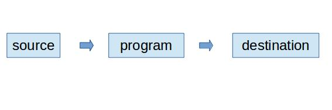
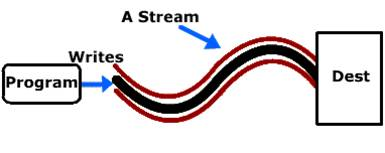
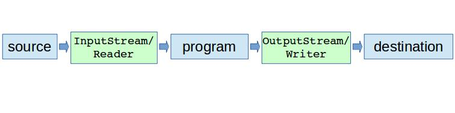
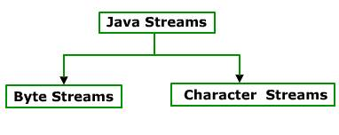
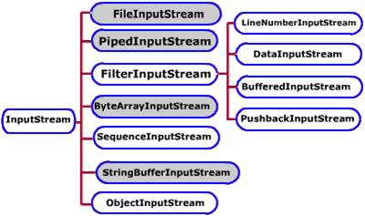
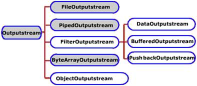

# Magatzems i fluxos de dades
* [Introducció](#introduccio)
* [Conceptes bàsics sobre fitxers seqüencials](#conceptes-basics-fitxers-sequencials)
  * [Creating a File](#creating-a-file)
  * [Writing to a File](#writing-to-a-file)
  * [Opening a File](#opening-a-file)
  * [Reading from a File](#reading-from-a-file)
  * [Exercicis](#exercicis)
* [Java Streams](#java-streams)
  * [Standard Streams](#standard-streams)
  * [Character Streams classes](#character-streams)
    * [Exercicis FileReader i FileWriter](#exercicis-file-reader-file-writer)
  * [Byte Streams classes](#byte-streams-classes)
    * [Data Streams](#data-streams)
    * [Object Streams](#object-streams)
    * [Random Access File](#random-access-file)
      * [Exemples](#exemples-random-access)
  * [Exercicis](#exercicis-streams)


## Introducció <a name="introduccio"></a>
En la primera part de la UF vam veure en Java (en el paquet `java.io`) que hi ha diferents classes que faciliten treballar amb fitxers des de diferents perspectives:

* Fitxers d'accés seqüencial o accés aleatori,
* Fitxers de caràcters o fitxers de bytes (binaris).

Els dos primers són una classificació segons el tipus de contingut que guarden. Els dos últims són classificats segons la manera d'accés.

Abans d'aprofundir en aquest tema cal clarificar el concepte de fitxers com a magatzems de contingut, i el concepte de contingut com a flux de dades.

## Els fitxers

Des del punt de vista de l’usuari, els fitxers són magatzems permanents d'informació guardada en forma de dades estructurades i ben organitzades de manera que la seva identificació i conseqüent interpretació siguin fàcils. Aquesta és una perspectiva centrada en la representació mental de la informació i s’anomena estructura lògica.

L'estructura lògica o representació conceptual de les dades va canviant a mida que avança pels diferents nivells d'abstracció fins a arribar al dispositiu d'emmagatzematge. La forma final de les dades es coneix també com estructura física. Ara bé, en el camí de la persistència, la representació mental original passarà per diferents nivells d'abstracció fins arribar a l’emmagatzematge físic(figura anterior).

Cada nivell imposarà les seves limitacions a la representació del nivell anterior introduint canvis que alteraran l'estructura original.

El primer nivell d'abstracció el trobem en el llenguatge de programació utilitzat, que depenent de les estructures d'informació suportades, els tipus de dades permesos, la representació en memòria d'aquest, etc., alterarà en alguna mesura la representació de partida.

El Sistema Operatiu imposarà també les seves restriccions i ho farà també el driver o adaptador al sistema d'emmagatzematge, o els mecanismes físics i els suport escollits en últim terme.

L’estructura final, com les dades acaben emmagatzemant-se, s’anomena també estructura física.

## Seriació

Les referències a memòria són dades transitòries que varien en cada execució. Si guardéssim de forma persistent les referències a memòria, en recuperar-les obtindríem dades totalment incoherents perquè apuntarien a dades inexistents o ocupades per altra informació.

Si volem un emmagatzematge i una recuperació de les dades eficaç, caldrà assegurar que totes les dades referenciades s’emmagatzemen també al fitxer i es relacionen entre elles de forma que sigui factible
localitzar-les i recuperar-les conjuntament.

La forma més senzilla de fer-ho consisteix a compactar les successives dades referenciades agrupant-les, una darrera l’altra, en una única seqüència de dades primitives lliure de referències.

Aquest procés s’anomena seriació i cal utilitzar-lo per transformar estructures complexes de la memòria principal en sèries de dades compactes i fàcilment emmagatzemables.

## Flux de dades

En Java, l'accés a fitxers és tractat com un flux d'informació entre el programa i el fitxer. Un flux no és més que un objecte que fa d'intermediari entre el programa i l'origen o la destinació de la informació.

Aquesta abstracció proporcionada pels fluxos fa que els programadors, quan volen accedir a informació, només s'hagin de preocupar per treballar amb els objectes que proporcionen el flux, sense importar l'origen o la destinació concreta d'on vinguin o vagin les dades.

Qualsevol programa que hagi de obtenir informació de qualsevol font necessita obrir un stream, igualment si necessita enviar informació obrirà un stream i s'escriurà la informació. La vinculació d'aquest stream amb el dispositiu físic la fa el sistema d'entrada / sortida de Java.

# Conceptes bàsics sobre fitxers seqüencials <a name="conceptes-basics-fitxers-sequencials"></a>

Començarem veient les operacions sobre fitxers seqüencials i després treballarem amb els aleatoris.

En els primers veurem les classes per la gestió dels fluxos de dades, primer en el cas dels fluxos binaris i després en el cas dels fluxos de caràcters.

* **Accés seqüencial**: les dades o registres es llegeixen i s'escriuen en ordre. Si es vol accedir a una dada cal llegir abans tots els anteriors. L'escriptura de dades es fa a partir de l'última dada escrita, no és
possible fer insercions entre les dades que ja hi existeixen.

Operacions bàsiques sobre fitxers:

* Creació del fitxer.
* Obertura del fitxer.
* Tancament del fitxer.
* Lectura de les dades del fitxer.
* Escriptura de les dades en el fitxer.

En els fitxers seqüencials els registres s'insereixen en ordre cronològic. Si cal afegir nous registres aquests s'afegeixen a partir final del fitxer:

* ***Consultes***: Per consultar un determinat registre és necessari començar la lectura des del primer registre, i continuar llegint seqüencialment fins a localitzar el registre buscat.

* ***Altes***: les altes es realitzen al final de l'últim registre inserit, només es permet afegir dades al final del fitxer.

* ***Baixes***: per donar de baixa un registre cal fer ús d'un fitxer auxiliar, llegint tots els registres i copiar tots a excepció del que vulguem donar de baixa. Finalment cal canviar el nom del fitxer auxiliar donant-li el nom del fitxer original.

* ***Modificacions***: El procés de modificacions és similar al de baixes

## Creating a File <a name="creating-a-file"></a>

If you want to create a new file, you must use a class that is equipped to write values to a file. To do this, you can use the PrintWriter class. The PrintWriter class is defined in the java.io package. Therefore, if you want to use it, you can import it in your document. This would be done as follows:

```java
import java.io.PrintWriter;

public class Exercise {
    public static void main(String[] args)  throws Exception {

    }
}
```

The `PrintWriter` class is based on (implements) the `Writer` class. The class is equipped with the necessary means of writing values to a file.

Before using the class, declare a variable for it. This class is equipped with many constructors. One of the constructors takes as argument an `OutputStream` object. We saw that the `File` class is based on `OutputStream`. This means that you can pass a `File` object to a `PrintWriter` constructor. This would be done as follows:

```java
import java.io.File;
import java.io.PrintWriter;

public class Exercise {
  public static void main(String[] args)  throws Exception {
  	// Indicate that you are planning to use a file
  	File fleExample = new File("Example.xpl");
    // Create that file and prepare to write some values to it
    PrintWriter pwInput = new PrintWriter(fleExample);
  }
}
```

## Writing to a File  <a name="writing-to-a-file"></a>

After creating a `PrintWriter` object, you can write values to the file. To support this, the `PrintWriter` class is equipped with the `print()` and `println()` methods that is overloaded with various versions for each type of values (`boolean, char, char[], int, float, double, String, or Object`). Therefore, to write a value to a file, call the appropriate version of the `PrintWriter.print()` method and pass the desired value. Here are examples:

```java
import java.io.File;
import java.io.PrintWriter;

public class Exercise {
  public static void main(String[] args)  throws Exception {
    // Indicate that you are planning to use a file
    File fleExample = new File("Example.xpl");
    // Create that file and prepare to write some values to it
    PrintWriter pwInput = new PrintWriter(fleExample);

    // Write a string to the file
    pwInput.println("Francine");
    // Write a string to the file
    pwInput.println("Mukoko");
    // Write a double-precision number to the file
    pwInput.println(22.85);
    // Write a Boolean value to the file
    pwInput.print(true);
  }
}
```

After using a `PrintWriter` object, you should free the resources it was using. To assist you with this, the `PrintWriter` class is equipped with the `close()` method. Here is an example of calling:

```java
import java.io.File;
import java.io.PrintWriter;

public class Exercise {
  public static void main(String[] args)  throws Exception {
    // Indicate that you are planning to use a file
    File fleExample = new File("Example.xpl");
    // Create that file and prepare to write some values to it
    PrintWriter pwInput = new PrintWriter(fleExample);

    // Write a string to the file
    pwInput.println("Francine");
    // Write a string to the file
    pwInput.println("Mukoko");
    // Write a double-precision number to the file
    pwInput.println(22.85);
    // Write a Boolean value to the file
    pwInput.print(true);
    // After using the PrintWriter object, de-allocated its memory
    pwInput.close();
    // For convenience, let the user know that the file has been created
    System.out.println("The file has been created.");   
  }
}
```

### Opening a File <a name="opening-a-file"></a>

Besides creating a file, the second most common operation performed on a file consists of opening one. You can open a file using the `File` class. As done previously, first declare a `File` variable and pass the name of the file to its `constructor`. Here is an example:

```java
import java.io.File;

public class Exercise {
  public static void main(String[] args)  throws Exception {
    // Incidate that you are planning to opena file
	  File fleExample = new File("Example.xpl");
  }
}
```

### Reading from a File <a name="reading-from-a-file"></a>

To support the ability to read a value from a file, you can use the Scanner class. To support this operation, the Scanner class is equipped with a constructor that takes a `File` object as argument. Therefore, you can pass it a `File` variable you will have previously declared. Here is an example of declaring and initializing a variable for it:

```java
import java.io.File;
import java.util.Scanner;

public class Exercise {
    public static void main(String[] args)  throws Exception {
	// Indicate that you are planning to opena file
	File fleExample = new File("Example.xpl");
        // Prepare a Scanner that will "scan" the document
        Scanner opnScanner = new Scanner(fleExample);
    }
}
```

The values of a file are stored in or more lines. To continuously read the lines from the file, one at a time, you can use a while loop. In the while loop, continuously use the `Scanner` object that can read a line of value(s). In the while statement, to check whether the `Scanner` object has not gotten to the last line, you can check the status of its `hasNext()` method. As long as this method returns true, the `Scanner` reader has not gotten to the end of the file. Once the `Scanner` object has arrived to the end, this method would return false. Here is an example of implementing this scenario:

```java
import java.io.File;
import java.util.Scanner;

public class Exercise {
    public static void main(String[] args)  throws Exception {
	// Indicate that you are planning to opena file
	File fleExample = new File("Example.xpl");
        // Prepare a Scanner that will "scan" the document
        Scanner opnScanner = new Scanner(fleExample);

	// Read each line in the file
        while(opnScanner.hasNext()) {
            // Read each line and display its value
	    System.out.println("First Name:    " + opnScanner.nextLine());
	    System.out.println("Last Name:     " + opnScanner.nextLine());
	    System.out.println("Hourly Salary: " + opnScanner.nextLine());
	    System.out.println("Is Full Time?: " + opnScanner.nextLine());
	}
    }
}
```

After using the `Scanner` object, to free the resources it was using, call its `close()` method. Here is an example:

```java
import java.io.File;
import java.util.Scanner;

public class Exercise {
  public static void main(String[] args) throws Exception {
    // Indicate that you are planning to opena file
    File fleExample = new File("Example.xpl");
    // Prepare a Scanner that will "scan" the document
    Scanner opnScanner = new Scanner(fleExample);

    // Read each line in the file
    while (opnScanner.hasNext()) {
      // Read each line and display its value
      System.out.println("First Name:    " + opnScanner.nextLine());
      System.out.println("Last Name:     " + opnScanner.nextLine());
      System.out.println("Hourly Salary: " + opnScanner.nextLine());
      System.out.println("Is Full Time?: " + opnScanner.nextLine());
    }

    // De-allocate the memory that was used by the scanner
    opnScanner.close();
  }
}
```

### Exercicis <a name="exercicis"></a>

#### Exercici 1
Implementa la classe `NumsToFile1.java` que escriu els números de `1100 a 1200` en un arxiu que amb nom `Num11001200.txt` a l'escriptori.

#### Exercici 2
Implementa la classe `CharsToFile1.java` que escrigui les lletres de `a` a `z` (una en cada línia i en minúscules) en un arxiu que hem anomenat `alphabeta.txt` a l'escriptori.

#### Exercici 3
Implementa la classe `CharsFileToScreen1.java` Llegir l'arxiu de l'exercici 2 i escriure en pantalla els caràcters un al costat de l'altre i en majúscules amb un espai entre cada caràcter.

#### Exercici 4
Implementa la classe `TreballadorsToFile1.java` . Cal que llegeixi valors des de consola `(Nom, Cognoms, Salari,  Casat)` de tants treballadors fins que en respondre a la pregunta `Vols Continuar?` la seva resposta sigui diferent a `Y`. Aquestes dades s'hauran d'emmagatzemar en un fitxer anomenat `treballadors.txt`. En aquest arxiu en cada fila s'emmagatzemarà un registre amb els valors separats per comes, amb tants registres com els que s'han introduït per consola.

#### Exercici 5
Implementa la classe `TreballadorsToScreen1.java`. Cal que llegeixi valors del fitxer `treballadors.txt` i mostri el resultat amb el següent format exemple:

```console
TREBALLADOR 1

Gerard

Paulino

1500

false

TREBALLADOR 2

.....

```

## Java Streams <a name="java-streams"></a>
The terms 'input' and 'output' can sometimes be a bit confusing. The input of one part of an application is often the output of another. Is an `OutputStream` a stream where output is written to, or output comes out from (for you to read)? After all, an `InputStream` outputs its data to the reading program, doesn't it? Personally, I found this a bit confusing back in the day when I first started out learning about Java IO.

In an attempt to clear out this possible confusion, I have tried to put some different names on input and output to try to link them conceptually to where the input comes from, and where the output goes.

Java's IO package mostly concerns itself with the reading of raw data from a source and writing of raw data to a destination. The most typical sources and destinations of data are these:

* Files
* Pipes
* Network Connections
* In-memory Buffers (e.g. arrays)
* System.in, System.out, System.error

The diagram below illustrates the principle of a program reading data from a source and writing it to some destination:



## Streams

IO Streams are a core concept in Java IO. A stream is a conceptually endless flow of data. You can either read from a stream or write to a stream. A stream is connected to a data source or a data destination. Streams in Java IO can be either byte based (reading and writing bytes) or character based (reading and writing characters).

A stream is a path travelled by data in a program. To bring in information a program opens a stream on an information source (a file, memory, a socket) and reads the information serially.

Similarly a program can send information to an external destination by opening a stream to a destination and writing the information out serially.

Depending upon the direction of the data, streams are classified into two categories:

* Input Streams
* Output Streams

***Input Streams***: Bringing Information in. To bring in information, open a stream on an information source (a file, memory, or socket) and read the information serially.


***Output Stream***: Sending Information Out. A program can send information to an external destination by opening a stream to a destination and writing the information out serially.



## The InputStream, OutputStream, Reader and Writer

A program that needs to read data from some source needs an `InputStream` or a `Reader`. A program that needs to write data to some destination needs an `OutputStream` or a `Writer`. This is also illustrated in the diagram below:



An `InputStream` or `Reader` is linked to a source of data. An `OutputStream` or `Writer` is linked to a destination of data.

## Stream classification

Depending upon data type on which they operate, `Java` streams are classified into 2 categories:




The `java.io` package contains a large number of stream classes that provide capabilities for processing all types of data. These classes may be categorized into two groups based on the data type on which they operate.

* **Byte Stream Classes**: Byte Stream Classes are classes that provide support for handling i/o operations on bytes.
* **Character Stream Classes**: Character Stream Classes are classes that provide support for managing i/o operations on characters.

### Java IO Purposes and Features

`java.io` contains many subclasses of the `InputStream`, `OutputStream`, `Reader` and `Writer` classes. The reason is, that all of these subclasses are addressing various different purposes. That is why there are so many different classes. The purposes addressed are summarized below:

* File Access
* Network Access
* Internal Memory Buffer Access
* Inter-Thread Communication (Pipes)
* Buffering
* Filtering
* Parsing
* Reading and Writing Text (Readers / Writers)
* Reading and Writing Primitive Data (long, int etc.)
* Reading and Writing Objects

These purposes are nice to know about when reading through the `java.io` classes. They make it somewhat easier to understand what the classes are targeting.

## Java IO Class Overview Table

Having discussed sources, destinations, input, output and the various IO purposes targeted by the Java IO classes, here is a table listing most (if not all) Java IO classes divided by input, output, being byte based or character based, and any more specific purpose they may be addressing, like buffering, parsing etc.


| | Byte Based |  | Character Based | |
|-|------------|--|-----------------|--|
| | Input |	Output |	Input |	Output |
| Basic | 	InputStream  |	OutputStream |	Reader | Writer |
|       |                |               | InputStreamReader | OutputStreamWriter |
| Arrays | ByteArrayInputStream | ByteArrayOutputStream | CharArrayReader | CharArrayWriter |
|  Files | FileInputStream | FileOutputStream | FileReader | FileWriter |
|       | RandomAccessFile | RandomAccessFile |         |        |
| Pipes | PipedInputStream | PipedOutputStream | PipedReader | PipedWriter |
| Buffering | BufferedInputStream | BufferedOutputStream | BufferedReader | BufferedWriter |
| Filtering | FilterInputStream | FilterOutputStream | FilterReader | FilterWriter |
| Parsing | PushbackInputStream |               | PushbackReader |        | 	
|       | StreamTokenizer |               | LineNumberReader |        | 
| Strings |                |               | StringReader | StringWriter | 	 	 	 	
| Data | DataInputStream | DataOutputStream |         |        |	
| Data - Formatted |                | PrintStream |         | PrintWriter | 	
| Objects | ObjectInputStream | ObjectOutputStream |         |        | 	 	
| Utilities | SequenceInputStream |               |         |        | 	 	 	 	
 	 	 	 	

## Using a Stream

1. Import the package java.io , which contains a collection of stream classes.
2. Create an object of input/output stream that is associated with the data source / destination.
3. Read/write data using this object's read/ write methods.
4. Finally close the stream by calling its close() method.

# Standard Streams <a name="standard-streams"></a>

All the programming languages provide support for standard I/O where user's program can take input from a keyboard and then produce output on the computer screen. If you are aware if C or C++ programming languages, then you must be aware of three standard devices STDIN, STDOUT and STDERR. Similar way Java provides following three standard streams

* **Standard Input**: This is used to feed the data to user's program and usually a keyboard is used as standard input stream and represented as `System.in`.

* **Standard Output**: This is used to output the data produced by the user's program and usually a computer screen is used to standard output stream and represented as `System.out`.

* **Standard Error**: This is used to output the error data produced by the user's program and usually a computer screen is used to standard error stream and represented as `System.err`.

The 3 streams `System.in`, `System.out`, and `System.err` are also common sources or destinations of data. Most commonly used is probably `System.out` for writing output to the console from console programs.

These 3 streams are initialized by the Java runtime when a JVM starts up, so you don't have to instantiate any streams yourself (although you can exchange them at runtime).

`System.in` is an `InputStream` which is typically connected to keyboard input of console programs. `System.in` is not used as often since data is commonly passed to a command line Java application via command line arguments, or configuration files. In applications with GUI the input to the application is given via the GUI. This is a separate input mechanism from Java IO.

`System.out` is a `PrintStream`. `System.out` normally outputs the data you write to it to the console. This is often used from console-only programs like command line tools. This is also often used to print debug statements of from a program (though it may arguably not be the best way to get debug info out of a program).

`System.err` is a `PrintStream`. `System.err` works like System.out except it is normally only used to output error texts. Some programs (like Eclipse) will show the output to System.err in red text, to make it more obvious that it is error text.

Simple `System.out` + `System.err` example: Here is a simple example that uses `System.out` and `System.err`:

```java
try {
  InputStream input = new FileInputStream("c:\\data\\...");
  System.out.println("File opened...");

} catch (IOException e){
  System.err.println("File opening failed:");
  e.printStackTrace();
}
```

Following is a simple program which creates `InputStreamReader` to read standard input stream until the user types a `q`:

```java
import java.io.*;

public class ReadConsole {
  public static void main(String[] args) {
    InputStreamReader cin = null;

    try {
      cin = new InputStreamReader(System.in);
      System.out.println("Enter characters, 'q' to quit.");
      char c;
      do {
        c = (char) cin.read();
        System.out.print(c);
      } while (c != 'q');
    } finally {
      if (cin != null) {
        cin.close();
      }
    }
  }
}
```

Let's keep above code in `ReadConsole.java` file and try to compile and execute it as below. This program continues reading and outputting same character until we press `q`:

# Character Stream Classes <a name="character-streams"></a>

Character stream classes can be used to read and write 16 bit Unicode characters.

* `Reader Stream class`: Used to read characters from file. These are functionally same as InputStream classes but these read characters instead of bytes.
* `Writer Stream class`: Used to write characters to file. These are functionally same as OutputStream classes but these write characters instead of bytes.

## Reading/Writing Characters

The Reader and Writer implement the streams that can handle characters. The two subclasses used for handling characters in files are FileReader and FileWriter.


### Character Strings

Character strings are used to work with any text that is represented by ASCII value set or Unicode. Examples of files you can work with through a character stream are plain text files, html documents and java source files. The classes used to read and write these streams are subclasses of readers and writers. These should be used for all text input instead of dealing directly with file streams.

### Reading Text Files

#### FileReader Stream

FileReader is the main class used when reading character streams from a file. This class inherits from InputStreamReader, which reads a file stream and converts the byte in integer value that represents Unicode characters. In the program given below the FileReader character stream is nested with BufferedReader stream because with character stream you can read one character at a time. But with BufferedReader you can read a line of text at a time using its ReadLine() method.

#### Example:

```java
package net.xeill.elpuig;

import java.io.*;

public class ReadCharFile {

  public static void main(String[] args) {

    try {

      FileReader file = new FileReader("ReadCharFile.java");
      BufferedReader inputStream = new BufferedReader(file);

      boolean eof = false;

      while (!eof) {
        String line = inputStream.readLine();
        if (line == null) eof = true;
        else System.out.println(line);
      }
      inputStream.close();

    } catch (Exception e) {
      System.out.println(e.getMessage());
    }
  }
}
```

## Writing Text Files

### FileWriter Stream

The `FileWriter` class is used to write character streams to a file. It is a subclass of `OutputStreamWriter` which has a behavior to convert Unicode character codes to bytes.

There are two `FileWriter` constructors. They are `FileWriter (String)` and `FileWriter (String, Boolean)`. The string indicates the name of the file that the character string will be directed into which can include a folders path also. The optional boolean argument should be equal to true if the file is to be appended to a existing text file.

```java
import java.io.*;

public class GenerateCharToFile {

  public static void main(String[] args) throws IOException {
    File abc = new File(System.getProperty("user.dir")+File.separator+"alphabeta5465.txt");
    FileWriter fw = new FileWriter(abc);
    try (BufferedWriter bfw = new BufferedWriter(fw)) {
      for (char c = 'a'; c <= 'z'; c++) {
        bfw .write(c+"\n");
      }
      bfw.close();
    } catch(Exception e) {

    }
  }
}
```
Next use the `FileWriter (String, Boolean)` constructor and run it.

This example shows how to write a `String Array` into a file.

```java
package net.xeill.elpuig;

import java.io.BufferedWriter;
import java.io.File;
import java.io.FileWriter;

public class ArrayToFile {
  public static void main(String[] args) {
    String[] text = {"Angel", "Estel", "Ona"};

    try {
      FileWriter fw = new FileWriter(System.getProperty("user.dir") + File.separator + "noms.txt", false);
      BufferedWriter bw = new BufferedWriter(fw);

      for (String t : text) {
        bw.write(t);
        bw.newLine();
      }
      bw.close();

    } catch (Exception e) {
      e.printStackTrace();
    }
  }
}
```

# Exercicis FileReader i FileWriter <a name="exercicis-file-reader-file-writer"></a>

#### Exercici 6

Implementa la classe `FileReaderAlpha.java` que llegeixi l'arxiu de alphabeta5465.txt i escriure en pantalla els caràcters un al costat (en majúscules) de l'altre amb un espai entre cada caràcter.

#### Exercici 7

Implementa la classe `CharsFileReader.java` que llegeixi caràcter a caràcter el contingut d'un fitxer de text donat.
ue escrigui les lletres de `a` a `z` (una en cada línia i en minúscules) en un arxiu que hem anomenat `alphabeta.txt` a l'escriptori.

#### Exercici 8

Implementa la classe `CopyFilesFRFW.java` que copii un fitxer de text donat en un altre especificat emprant les classes `FileReader` i `FileWriter`.

#### Exercici 9
Implementa la classe `CopyDirFRFW.java` que copii els fitxers continguts en un directori donat en un altre especificat emprant les classes `FileReader` i `FileWriter`.

#### Exercici 10
Implementa la classe `CopyArrayToFile.java` que rebi un array de paraules i una ruta a un arxiu, guardi a l'arxiu una paraula sota l'altra. Després ensenyar el contingut de l'arxiu per pantalla. Cal fer-ho en dos mètodes, un per guardar en l'arxiu i un altre per ensenyar per pantalla.

#### Exercici 11
Implementa la classe `ComptaVocals.java` que en llegir un fitxer de text, generi un fitxer csv on la primera fila sigui `a,e,i,o,u` i totes les files següents representin el nombre d'ocurrències de cada vocal en cada línia del fitxer de lectura.

#### Exercici 12
Implementa la classe `RecordsTextToCSV.java` que en llegir un fitxer de text tal i com es mostra a l'exemple:

```console
Mihaita
Minca
21
****
Daniel
Barrueco
19
****
Ferran
Boutin
19
****
```

Generi un fitxer csv on la primera fila sigui nom, cognoms, edat i les següents les ocurrències que apareixen en el fitxer de lectura. Presuposem l'ús de 3 arrays `String[]` per tal d'emmagatzemar temporalment les ocurrències aparegudes després de la lectura. Posteriorment es llegiran aquests tres arrays i s'enregisrarà el seu contingut en el fitxer csv de sortida. Es demana implementar tres mètodes. `llegeixFitxer()`, `mostraPerPantalla()` i `escriuSortidaCSV()`

#### Exercici 13
Implementa la classe `CSVToScreen.java` que en llegir un fitxer csv on els diferents camps es defineixen en la primera fila: `firstname, lastname, username, password, email`.

La sortida generada pel programa serà semblant a la següent:

```console
Persona 1
firstname: John
lastname: Doe
username: john
password: constrasenia
email: john@elpuig.xeill.net
****
Persona 2
....
```

Cal tenir en compte que les columnes poden permutar i la sortida caldria que fos igual de coherent. Per això es decideix emmagatzemar els valors de la primera fila d'entrada en un array `String[]`.

# Byte Streams classes <a name="byte-streams-classes"></a>
***Byte Stream Classes***

Byte stream classes have been designed to provide functional features for creating and manipulating streams and files for reading and writing bytes. Since the streams are unidirectional they can transmit bytes in only one direction and therefore java provides two kinds of bytes stream classes i.e. input stream classes and output stream classes.

***Input Stream Classes***

Input stream classes that are used to read 8 bit bytes, include a super class known as InputStream and a number of subclasses for supporting various input related functions.





***Output Stream Classes***

Output stream classes are derived from the base class OutputStream. This is an abstract class and has several subclasses and these subclasses can be used for performing output operations.




***File Streams***
These handle writing and reading bytes to/from files.

* FileInputStream:

A FileInputStream can be created with the FileInputStream (String constructor). The string argument should be the name of the file. After you create a file input stream you can read bytes from the stream by calling its read() method. This method returns an integer containing the next byte in the stream. If the method returns a -1 it signifies that end of the file stream has been reached.

```java
import java.io.FileInputStream;
import java.io.IOException;

public class InputBytes {
  public static void main(String[] args) {
    try {

      FileInputStream fis = new FileInputStream("path/to/file.class");
      boolean eof = false;

      int count = 0;

      while (!eof) {
        int data = fis.read();
        System.out.println(data + " ");

        if (data == -1) eof = true;
        else count++;
      }
      fis.close();
      System.out.println("\nTotal number of bytes readed: "+count);

    } catch(IOException e) {
      System.out.println("ERROR");
      e.printStackTrace();
    }
  }
}

```

* File Output Stream:

    A file output stream can be created with FileOutputStream (String Constructor). The string argument should be the name of the file.

Note: You have to be careful when specifying the file to which to write an output stream. If it is the same as an existing file, the original contents will be lost when you start writing data to the stream.

You can create a FileOutputStream that appends data after the end of an existing file with the FileOutputStream (String, Boolean) constructor. The string specifies the file and the Boolean argument should equal to true to append data instead of overwriting any existing data.

The file output streams write (int) method is used to write bytes to the stream. After the last byte has been written to the file the streams close() method closes the stream.

```java
import java.io.IOException;

public class OutputBytes {

  public static void main(String[] args) {
    int data[] = {65, 66, 67, 68, 69};

    try {
      FileOutputStream fos = new FileOutputStream("path/to/file");
      for (int i = 0; i < data.length; i++) {
        fos.write(data[i]);
      }
      fos.close();
    } catch(IOException e) {
      System.out.println("ERROR");
      e.printStackTrace();
    }
  }
}
```

## Data Streams <a name="data-streams"></a>

These are Filter streams used to read/write primitive data types instead of raw bytes.

* To read primitives: DataInputStream.
* To write primitives: DataOutputStream.

### DataInputStream and DataOutputStream

If you want to work with data that is not represented as bytes or characters you can use DataInputStream and DataOutputStream. These streams filter an existing byte stream so that each of the following primitive types can be read or written directly from the stream i.e. Boolean, byte, double, float, int, long and short.

The data input stream is created with the `DataInputStream`|`Input Stream` constructor. The argument should be an existing input stream such as an buffer input stream or file input stream. Conversely, a data output stream requires a `DataOutputStream`|`Output Stream` constructor which indicates the associated output stream.

Each of the input method returns the primitive data type indicated by the name of the method
For example, `readDouble()` method returns a double value.

#### Example:

```java
package net.xeill.elpuig;

import java.io.DataOutputStream;
import java.io.FileOutputStream;

public class WriteEven {
  public static void main(String[] args) {
    try {
      FileOutputStream file = new FileOutputStream("src/archivos/even.dat");
      DataOutputStream data = new DataOutputStream(file);

      for (int i = 0; i < 25 ; i++) {
        data.writeInt(i*2);
      }

      data.close();
    } catch (Exception e) {
      e.printStackTrace();
    }
  }
}
```

```java
package net.xeill.elpuig;

import java.io.DataInputStream;
import java.io.EOFException;
import java.io.FileInputStream;

public class ReadEven {

  public static void main(String[] args) {
    try {
      FileInputStream file = new FileInputStream("src/archivos/even.dat");
      DataInputStream data = new DataInputStream(file);

      int number;

      try {
        while (true) {
          number = data.readInt();
          System.out.println(number+" ");
        }
      } catch (EOFException e) {
        data.close();
      }

    } catch (Exception e) {
      e.printStackTrace();
    }
  }
}
```

```java
Using Data Streams

DataInputStream dis = new DataInputStream(fis);

char c = dis.readChar();

byte b = dis.readByte();
```

Similarly,

```java
DataOutputStream dos =new DataOutputStream(fos);

dos.writeChar(c);

dos.writeByte(b);
```

## Object Streams <a name="object-streams"></a>
### ObjectInputStream

The Java `ObjectInputStream` class `java.io.ObjectInputStream` enables you to read Java objects from an `InputStream` instead of just raw bytes. You wrap an `InputStream` in a `ObjectInputStream` and then you can read objects from it. Of course the bytes read must represent a valid, serialized Java object. Otherwise reading objects will fail.

Normally you will use the `ObjectInputStream` to read objects written (serialized) by a Java `ObjectOutputStream`. You will see an example of that later.

Here is a Java `ObjectInputStream` example:

```java
ObjectInputStream objectInputStream =
    new ObjectInputStream(new FileInputStream("object.data"));

MyClass object = (MyClass) objectInputStream.readObject();

objectInputStream.close();
```

For this `ObjectInputStream` example to work the object you read must be an instance of `MyClass`, and must have been serialized into the file `object.data` via an `ObjectOutputStream`.

Before you can serialize and de-serialize objects the class of the object must implement `java.io.Serializable`.

When you are finished reading data from the `ObjectInputStream` you should remember to close it. Closing a `ObjectInputStream` will also close the `InputStream` instance from which the `ObjectInputStream` is reading.

Closing a `ObjectInputStream` is done by calling its `close()` method. Here is how closing a `ObjectInputStream` looks:

```java
objectInputStream.close();
```

You can also use the try-with-resources construct introduced in Java 7. Here is how to use and close a `ObjectInputStream` looks with the try-with-resources construct:

```java
InputStream input = new FileInputStream("data/data.bin");

try(ObjectInputStream objectInputStream =
    new ObjectInputStream(input)){

    Person personRead = (Person) objectInputStream.readObject();
}
```

Notice how there is no longer any explicit `close()` method call. The try-with-resources construct takes care of that.

Notice also that the first `FileInputStream` instance is not created inside the try-with-resources block. That means that the try-with-resources block will not automatically close this `FileInputStream` instance. However, when the `ObjectInputStream` is closed it will also close the `InputStream` instance it reads from, so the `FileInputStream` instance will get closed when the `ObjectInputStream` is closed.

### ObjectOutputStream

The Java `ObjectOutputStream` class `java.io.ObjectOutputStream` enables you to write Java objects to an `OutputStream` instead of just raw bytes. You wrap an `OutputStream` in a `ObjectOutputStream` and then you can write objects to it.

The Java `ObjectOutputStream` is often used together with a Java `ObjectInputStream`. The `ObjectOutputStream` is used to write the Java objects, and the `ObjectInputStream` is used to read the objects again. You will see an example of this later.

Here is a Java `ObjectOutputStream` example:

```java
ObjectOutputStream objectOutputStream =
    new ObjectOutputStream(new FileOutputStream("object.data"));

MyClass object = new MyClass();

output.writeObject(object);

output.close();
```

First this examples creates a `OutputOutputStream` connected to a `FileOutputStream`. Then the example creates a `MyClass` object and writes it to the `ObjectOutputStream`. Finally the example closes the `ObjectOutputStream`.

Before you can serialize and de-serialize objects the class of the object must implement `java.io.Serializable`.

## Using an ObjectInputStream With an ObjectOutputStream

I promised earlier to show you an example of using the Java ObjectInputStream with the `ObjectOutputStream`. Here is that example:

```java
package net.xeill.elpuig;

import java.io.*;

public class ObjectStreamExample {

  public static class Person implements Serializable {
    public String name = null;
    public int age = 0;
  }

  public static void main(String[] args) {

    Person p = new Person();
    p.name = "John";
    p.age = 22;

    Person q = new Person();
    q.name = "Mary";
    q.age = 24;

    Person r, s ;

    r = s = null;

    try {
      ObjectOutputStream objectOutputStream = new ObjectOutputStream(new FileOutputStream("src/archivos/person.bin"));
      objectOutputStream.writeObject(p);
      objectOutputStream.writeObject(q);
      objectOutputStream.close();
    } catch (Exception e) {
      e.printStackTrace();
    }

    try {
      ObjectInputStream objectInputStream = new ObjectInputStream(new FileInputStream("src/archivos/person.bin"));
      r = (Person) objectInputStream.readObject();
      s = (Person) objectInputStream.readObject();

      objectInputStream.close();

    } catch (Exception e) {
      e.printStackTrace();
    }

    System.out.println(r.name +": "+ r.age);
    System.out.println(s.name +": "+ s.age);

  }
}

```
This example first creates an ObjectOutputStream connected to a FileOutputStream. Then it creates a Person object and writes it to the ObjectOutputStream, and then closes the ObjectOutputStream.

Then the example creates an `ObjectInputStream` connected to the same file the `ObjectOutputStream` was connected to. The example then reads in an object from the `ObjectInputStream` and casts it to a `Person` object. After that the `ObjectInputStream` is also closed, and the values read into the `Person` object are printed to `System.out`.


## RandomAccessFile <a name="random-access-file"></a>

The `RandomAccessFile` class in the `java.io` API allows you to move around a file and read from it or write to it as you please. You can replace existing parts of a file too. This is not possible with the `FileInputStream` or `FileOutputStream`.

### Creating a RandomAccessFile

Before you can work with the `RandomAccessFile` class you must instantiate it. Here is how that looks:

```java
RandomAccessFile file = new RandomAccessFile("c:\\data\\file.txt", "rw");
```

Notice the second input parameter to the constructor: `rw`. This is the mode you want to open file in. `rw` means `read/write` mode. Check the JavaDoc for more details about what modes you can open a `RandomAccessFile` in.

### Moving around a RandomAccessFile

To read or write at a specific location in a `RandomAccessFile` you must first position the file pointer at the location to read or write. This is done using the `seek()` method. The current position of the file pointer can be obtained by calling the `getFilePointer()` method.

Here is a simple example:

```java
RandomAccessFile file = new RandomAccessFile("c:\\data\\file.txt", "rw");

file.seek(200);

long pointer = file.getFilePointer();

file.close();
```

### Reading from a RandomAccessFile

Reading from a `RandomAccessFile` is done using one of its many `read()` methods. Here is a simple example:

```java
RandomAccessFile file = new RandomAccessFile("c:\\data\\file.txt", "rw");

int aByte = file.read();

file.close();
```

The `read()` method reads the byte located at the position in the file currently pointed to by the file pointer in the `RandomAccessFile` instance.

Here is a thing the JavaDoc forgets to mention: The `read()` method increments the file pointer to point to the next byte in the file after the byte just read. This means that you can continue to call `read()` without having to manually move the file pointer.

### Writing to a RandomAccessFile

Writing to a `RandomAccessFile` can be done using one it its many `write()` methods. Here is a simple example:

```java
RandomAccessFile file = new RandomAccessFile("fitxer.bin", "rw");

file.write("Hello World".getBytes());

file.close();
```

Just like with the `read()` method the `write()` method advances the file pointer after being called. That way you don't have to constantly move the file pointer to write data to a new location in the file.

### close()

The `RandomAccessFile` has a `close()` method which must be called when you are done using the `RandomAccessFile` instance. You can see example of calls to `close()` in the examples above.

### RandomAccessFile Exception Handling

The proper exception handling of a `RandomAccessFile` is left out of this text for clarity. However, a `RandomAccessFile` must be closed properly after use, just like with a stream or `reader/writer`. This requires proper exception handling around the `close()` call.

#### Exemples <a name="exemples-random-access"></a>

1. We want to make a program, given an initial file and a specific letter `X`, changing the file every letter `X` in capital letters.

Exemple `CanviLletra` amb `read()`

```java
package net.xeill.elpuig;

import java.io.*;

public class CanviLletra {

  public static void main(String[] args) {

    try {

      RandomAccessFile randomAccessFile = new RandomAccessFile(new File("src/archivos/texto.txt"), "rw");
      char x = 'r';

      char c;
      int lectura;

      while ((lectura = randomAccessFile.read()) != -1) {
        try {

          c = (char) lectura;

          if (c == x) {
            randomAccessFile.seek(randomAccessFile.getFilePointer() - 1);
            //randomAccessFile.write(Byte.parseByte(String.valueOf(Character.toUpperCase(c))));
            randomAccessFile.writeByte(Character.toUpperCase(c));
          }
        } catch (EOFException e) {
          e.printStackTrace();

        }
      }
      randomAccessFile.close();

    } catch (FileNotFoundException e) {
      e.printStackTrace();
    } catch (IOException e) {
      e.printStackTrace();
    }
  }
}

```

Exemple `CanviLletra` amb `readByte()`

```java
package net.xeill.elpuig;

import java.io.*;

public class CanviLletraReadByte {

  public static void main(String[] args) {

    try {

      RandomAccessFile randomAccessFile = new RandomAccessFile(new File("src/archivos/texto.txt"), "rw");
      char x = 'r';

      char c;
      int lectura;
      boolean fin = false;

      do {
        try {
          lectura = randomAccessFile.readByte();
          c = (char) lectura;

          if (c == x) {
            randomAccessFile.seek(randomAccessFile.getFilePointer() - 1);
            //randomAccessFile.write(Byte.parseByte(String.valueOf(Character.toUpperCase(c))));
            randomAccessFile.writeByte(Character.toUpperCase(c));
          }
        } catch (EOFException e) {
          fin = true;
          randomAccessFile.close();
          System.out.println("Hem acabat de llegir el fitxer.");
        }

      } while (!fin);

    } catch (FileNotFoundException e) {
      e.printStackTrace();
    } catch (IOException e) {
      e.printStackTrace();
    }
  }
}

```

2. Es demana fer un programa que escrigui un fitxer aleatori amb les dades d'empleats, tenint en compte les següents consideracions:

Les dades a inserir són: `cognom`, `departament` i `salari`.

Les dades es van introduint de forma seqüencial, no s'usarà el mètode `seek()`.
Per cada empleat també s'inserirà un identificador que coincidirà amb l'`index+1` amb què es recorren els arrays.

La longitud del registre de cada empleat és la mateixa `36 bytes` i els tipus que s'insereixen i la seva grandària en bytes és el següent:

* **Identificador**: és un `int`, ocupa `4 bytes`
* **Cognom**: cadena de `10 caràcters`. Com cada `char` Unicode ocupa `2 bytes` llavors el cognom ocupa `20 bytes`.
* **Departament**: és un `int`, ocupa `4 bytes`.
* **Sou**: és un `double`, ocupa `8 bytes`.

```java
package net.xeill.elpuig;

import java.io.File;
import java.io.FileNotFoundException;
import java.io.IOException;
import java.io.RandomAccessFile;

public class RandomWrite {

  public static void main(String[] args) {
    /*
    Identificador: és un enter, ocupa 4 bytes
    Cognom: cadena de 10 caràcters. Com cada caràcter Unicode ocupa 2 bytes llavors el cognom ocupa 20 bytes
    Departament: és un enter, ocupa 4 bytes.
    Sou: és un double, ocupa 8 bytes.
    */

    String[] cognoms = {"Parker", "Ocón", "Ben", "Orrit"};
    int[] departaments = {11, 22, 33, 44};
    double[] salaris = {1111.11, 2222.22, 3333.33, 4444.44};

    try {
      RandomAccessFile randomAccessFile = new RandomAccessFile(new File("src/archivos/empleats.txt"), "rw");

      for (int i = 0; i < cognoms.length ; i++) {
        // Identificador
        randomAccessFile.writeInt(i+1);
        // String[10] amb el cognom
        StringBuffer sBuffer = new StringBuffer(cognoms[i]);
        sBuffer.setLength(10);
        randomAccessFile.writeChars(sBuffer.toString());
        // Departament
        randomAccessFile.writeInt(departaments[i]);
        // Salari
        randomAccessFile.writeDouble(salaris[i]);
      }
      randomAccessFile.close();

    } catch (FileNotFoundException e) {
      e.printStackTrace();
    } catch (IOException e) {
      e.printStackTrace();
    }
  }
}

```

3. Com a continuació de l'exercici anterior, es demana fer un programa que afegexi un registre amb un identificador determinat.

```java
package net.xeill.elpuig;

import java.io.File;
import java.io.FileNotFoundException;
import java.io.IOException;
import java.io.RandomAccessFile;

public class RandomWritePosition {

  public static void main(String[] args) {
    /*
    Identificador: és un enter, ocupa 4 bytes
    Cognom: cadena de 10 caràcters. Com cada caràcter Unicode ocupa 2 bytes llavors el cognom ocupa 20 bytes
    Departament: és un enter, ocupa 4 bytes.
    Sou: és un double, ocupa 8 bytes.
    */

    String cognom = "Martin";
    StringBuffer bCognom = new StringBuffer(cognom);
    bCognom.setLength(10);

    int departament = 55;
    double salari = 5555.55;

    int position = 7;

    try {
      RandomAccessFile randomAccessFile = new RandomAccessFile(new File("src/archivos/empleats.txt"), "rw");

      randomAccessFile.seek((position - 1) * 36);

      // Identificador
      randomAccessFile.writeInt(position);
      // String[10] amb el cognom
      randomAccessFile.writeChars(bCognom.toString());
      // Departament
      randomAccessFile.writeInt(departament);
      // Salari
      randomAccessFile.writeDouble(salari);

      randomAccessFile.close();

    } catch (FileNotFoundException e) {
      e.printStackTrace();
    } catch (IOException e) {
      e.printStackTrace();
    }
  }
}

```

4. Per finalitzar, llegir el fitxer creat als exemples anteriors i mostrar per pantalla totes les dades.

```java
package net.xeill.elpuig;

import java.io.File;
import java.io.FileNotFoundException;
import java.io.IOException;
import java.io.RandomAccessFile;

public class ShowRandomFile {

  /*
    Identificador: és un enter, ocupa 4 bytes
    Cognom: cadena de 10 caràcters. Com cada caràcter Unicode ocupa 2 bytes llavors el cognom ocupa 20 bytes
    Departament: és un enter, ocupa 4 bytes.
    Sou: és un double, ocupa 8 bytes.
  */

  public static void main(String[] args) {

    try {
      RandomAccessFile randomAccessFile = new RandomAccessFile(new File("src/archivos/empleats.txt"), "r");

      int id, departament, position;
      double salari;
      String sCognom;
      char[] cognom;

      // Nos colocamos al incio del fichero
      position = 0;

      while (randomAccessFile.getFilePointer() != randomAccessFile.length()) {

        // Nos movemos a la posición del siguiente empleado que vamos a leer
        randomAccessFile.seek(position);

        // Identificador
        id = randomAccessFile.readInt();
        // Cognom (inicializamos)
        cognom = new char[10];
        // Cognom (lectura)
        for (int i = 0; i < cognom.length; i++) {
          cognom[i] = randomAccessFile.readChar();
        }
        sCognom = new String(cognom);

        // Departament
        departament = randomAccessFile.readInt();

        // Salari
        salari = randomAccessFile.readDouble();

        // Imprimimos
        System.out.println("Identificador: " + id);
        System.out.println("Cognom: " + sCognom);
        System.out.println("Departament: " + departament);
        System.out.println("Salari: " + salari);

        // Avanzamos la posición del puntero
        position += 36;
      }

      randomAccessFile.close();

    } catch (FileNotFoundException e) {
      e.printStackTrace();
    } catch (IOException e) {
      e.printStackTrace();
    }
  }
}

```

## Exercicis <a name="exercicis-streams"></a>

### Exercici 14
Implementa la classe `CopyFilesBin.java` que copii un fitxer binari donat (i.e. un png) en un altre especificat emprant les classes corresponents.

### Exercici 15

Implementa la classe `CopyDirFISFOS.java` que copii els fitxers continguts en un directori donat en un altre especificat emprant les classes `FileInputStream`  i `FileOutputStream`.

### Exercici 16

Implementa una classe `FileTypes.java` que escrigui dades en un fitxer, dades de diferents tipus: `int`, `char`, `float`, `double`, `String`, `boolean`, etc. Feu servir la classe `DataOutputStream`.

Ensenyar per pantalla les dades de l'arxiu, primer fent servir la classe `FileReader/BufferedReader` i després les `DataInputStream`.

Quina és la diferencia? Que ha passat? Quina és l'explicació?

### Exercici 17

Refina la classe `ObjectStreamExample.java` de manera que:

* Treballi una classe `Persona` externa amb els mateixos atributs privats i mètodes `getters` i `setters`.

* Es creïn diferents objectes de tipus `Persona` i s'enregistren en un fitxer mitjançant el mètode `introDades()`

* Llegir de nou el fitxer mitjançant el mètode `mostraDades()`. Tots els objectes de tipus `Persona` llegits es carregaran en un `ArrayList`.

* Posteriorment es recorrerà l'`ArrayList` i es mostraran les dades de les diferents persones per pantalla.

### Exercici 18

Implementar la classe `CSVToObjectFile.java` de manera que:

Treballi una classe `User` externa amb atributs privats (`username, firstname,lastname, email i password`) i els corresponents mètodes `getters` i `setters` i `constructor` amb tots els atributs.

Es creïn diferents objectes de tipus `User` a partir de la lectura d'un fitxer `CSV`  on es tenen enregistrats en l'ordre especificat prèviament. Aquests objectes s'emmagatzemen en un `ArrayList`. El mètode s'anomenarà `loadUsers()`

Llegir tots els objectes de tipus `User`. Mostrar els seus atributs per pantalla i emmagatzemar els objectes en el fitxer `users.bin` mitjançant el mètode `writeUsers()`.

### Exercici 19

Implementar la classe `ObjectFileToCSV.java` de manera que:

Treballi amb l'anterior classe `User` externa amb atributs privats (`username, firstname,lastname, email i password`) i els corresponents mètodes `getters` i `setters` i `constructor` amb tots els atributs.

Es creïn diferents objectes de tipus `User` a partir de la lectura d'un fitxer binari on s'emmagatzemen aquests objectes (aquest fitxer és el resultat de l'exercici anterior `users.bin`. Aquests objectes s'emmagatzemen en un `ArrayList` però prèviament es mostren els seus atributs per pantalla, es recomanable implementar un mètode `toString()` a la classe `User`. El mètode s'anomenarà `loadUsers()`

Llegir tots els objectes de tipus `User`. Emmagatzemar els valors dels atributs `username`, `firstname` i `lastname` en el fitxer `users2.csv`  en l'ordre mitjançant el mètode `writeUsersToCSV()`.

### Exercici 20

Es demana fer un programa `MyRandomWrite.java` que escrigui un fitxer aleatori amb les dades de departaments, tenint en compte les següents consideracions:

Les dades a inserir són: codi del departament i el nom departament.

Els noms dels departaments es llegeixen des d'un array i el seu identificador serà `(posició+1)*10` que ocuparà dins del fitxer per a cada valor.

La longitud del registre de cada departament és la mateixa `24 bytes` i els tipus que s'insereixen i la seva grandària en bytes és el següent:

* **codi**: és un enter, ocupa `4 bytes`
* **nom**: cadena de `10 caràcters`. Com cada caràcter Unicode ocupa `2 bytes` llavors el cognom ocupa `20 bytes`.

### Exercici 21

Es demana fer un programa `ShowDepts.java` que llegeixi seqüencialment el fitxer de departaments i que per a cada departament (que el seu `id` sigui diferent de `0`) mostri el nom del departament i el nom dels treballadors que pertanyen. (Són dos accessos seqüencials).

### Exercici 22

Es demana fer un programa `ShowTreballadors.java` que llegeixi el fitxer de treballadors de manera seqüencial i el de departaments de manera aleatòria de manera que per a cada treballador mostri el nom i el nom del departament al que pertany.
