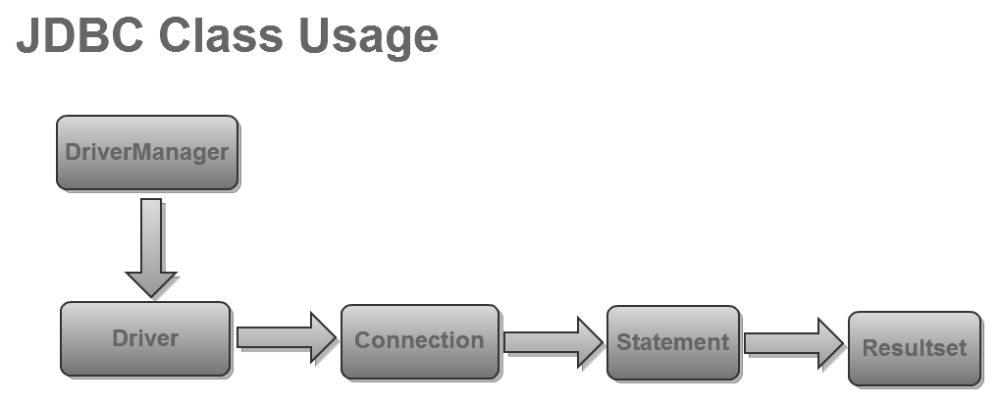

# Programació amb JDBC
* [Introducció a JDBC](#intro-jdbc)
* [Connexió a una base de dades](#connexio-base-dades)
* [Consultes i modificacions bàsiques](#consultes-modificacions-basiques)
* [Execució de sentències SQL: la classe Statement](#execucio-sentencies-statement)
* [Tractament de resultats: la classe ResultSet](#tractament-resultats-resultset)
* [Consultes i modificacions avançades](#consultes-modificacions-avancades)

## Introducció a JDBC <a name="intro-jdbc"></a>
Suposem que volem desenvolupar una aplicació en `Java` i que ja hem decidit quin `SGBD` i driver utilitzarem.

Vegem com s'usa l'`API JDBC`, és a dir, com es programa mitjançant les classes d'aquesta biblioteca.

Començarem veient com s'estableix connexió amb una BD.

A continuació aprendrem la manera d'enviar consultes, tractar els resultats, fer modificacions i treballar amb procediments emmagatzemats.

Finalment veurem la manera de gestionar les transaccions i el tractament d'errors.

Recursos necessaris:
`JDBC4 Postgresql Driver` https://jdbc.postgresql.org/download.html

# Connexió a una base de dades <a name="connexio-base-dades"></a>

El primer pas per treballar amb una BD és la connexió. Per a poder-nos connectar cal seguir quatre passos:

1. Importar els packages necessaris. Tal com s'ha comentat, l'`API JDBC` és formada per dos packages, `java.sql` i `javax.sql`. El primer conté les classes i interfícies essencials (inclou les classes `Driver`,  `Connection`, `Statement`, `ResultSet`, `PreparedStatement`, `CallableStatement`, principalment) i l'haurem d'importar sempre. El segon és l'extensió estàndard i conté classes més especialitzades que s'escapen dels objectius d'aquest nucli formatiu  (`RowSet`, `DataSource` i `PooledConnection`, entre d'altres).

2. Carregar el driver adequat. La manera tradicional de carregar un driver és forçant la càrrega del driver a partir del seu nom, utilitzant el mètode `forName()` de la classe `Class`. Per exemple, per carregar el driver del `PostgreSQL` faríem el següent:

	```java
	Class.forName( "org.postgresql.Driver" );
	```

	Aquest nom identifica la classe `Driver` del package `org.postgresql` (recordem que és la classe que implementa la interfície `java.sql.Driver`). Si volem utilitzar un altre driver haurem de fer una mica d'investigació per esbrinar el nom del `package` i el nom de la classe que implementa la interfície `java.sql.Driver`.

	Carregar una classe a partir del seu nom pot fallar si el classloader (objecte responsable de carregar les classes necessàries per a l'execució d'un programa) no és capaç de trobar cap classe amb aquest nom. Per tant, ens hem d'assegurar que el `CLASSPATH` apunti al fitxer (normalment `.jar`) que conté el driver. En cas de no trobar-la, es genera una excepció de tipus `ClassNotFoundException`.

	En la versió `JDBC 4.0` es proposa delegar la responsabilitat de carregar el driver al `DriverManager`, que serà l'encarregat de buscar el driver en els directoris o fitxers jar definits al `CLASSPATH` quan siguin necessaris.

3. Obrir la connexió. Tot i que el concepte d'obrir connexió sigui simple, amaga una certa complexitat quan hem d'indicar la BD que volem obrir.

	```java
	String dbURL="jdbc:postgresql://localhost/bdMail";
	Connection conn = DriverManager.getConnection( dbURL,"usuari","contrasenya");
	```

	L'encarregat d'obrir una connexió amb una BD és el `DriverManager`, per mitjà del mètode `getConnection()` i requereix tres paràmetres:


	a. El primer és l'anomenat url i identifica la BD a la qual ens volem connectar. És una cadena formada per tres parts: la primera sempre és `jdbc` i la resta, variables.

	`jdbc:<subprotocol>:<subname>`

	El subprotocol és el nom del driver que utilitzarem per a connectar-nos. Un altre cop, cal fer una mica d'investigació.

	El subname serveix per a identificar la BD pròpiament. El seu format depèn del driver que emprem i, per tant, no té un format estàndard. Aquest és un tercer punt d'investigació.

	En els casos més explícits, identifica el servidor (on hi ha l'SGBD), el port on escolta l'SGBD i el nom de la BD. Si no indiquem servidor s'entén que és el mateix ordinador (localhost) i, si tampoc no ho fem amb el port, s'entén que és el port per defecte de l'SGBD.

	En l'exemple anterior ens estaríem connectant a una BD PostgreSQL que hi ha en el mateix ordinador, escoltant el port per defecte i que s'anomena bdMail.

	b. El segon i tercer paràmetres corresponen al nom d'usuari de la BD i a la contrasenya corresponent. Cal assegurar-nos que ens connectem amb un usuari que tingui suficients privilegis per a executar les sentències SQL que vinguin a continuació.

4. Tancar la connexió. Sens dubte, és l'operació més senzilla de les vistes fins ara. Simplement cal cridar el mètode `close()` de la connexió que volem tancar.

	```java
	conn.close();
	```

	Si no tanquem la connexió ho farà el garbage collector quan destrueixi l'objecte connexió.
	En tot cas, en aplicacions client és molt important tancar les connexions quan ja no les volem utilitzar; així aconseguim que el servidor alliberi recursos i que els pugui dedicar a un altre client.

	Arribats en aquest punt ens podem plantejar si els passos que anem seguint són elegants. Hem indicat el nom del driver a l'hora de carregar-lo, i l'hem de tornar a indicar a l'hora de connectar-nos. És necessària aquesta redundància? En la versió `JDBC 4.0` es delega la càrrega de drivers al `DriverManager`, de manera que només cal indicar el driver en el moment de crear la connexió.

	També ens podem plantejar si és convenient indicar l'equip, el port, el nom de la BD, el nom d'usuari i la contrasenya en el codi font. Ho és? No massa, especialment si volem distribuir l'aplicació sense haver-la de recompilar cada cop! De fet, a partir de `JDBC 2.0` ja es proposa utilitzar una interfície anomenada `DataSource` per a desvincular el codi font dels detalls de connexió.

## Exemple 1

Verifica que pots realitzar la connexió amb la base de dades amb aquest exemple emprant d'IDE Eclipse

***ex001Connexio.java***

```java
// export CLASSPATH=/usr/share/java/postgresql.jar:.

import java.sql.*;
import java.io.*;

public class ex001Connexio
{
	public static void main( String[] args ) throws Exception
	{
		//Carreguem el driver de postgreSQL
		Class.forName( "org.postgresql.Driver" );

		//Obrim la connexió amb la base de dades anomenada dbMail
		//utilitzant el driver de postgreSQL
		//Ens connectem amb "usuari" amb contrassenya "usuari"
		String dbURL="jdbc:postgresql:bdMail";
		Connection conn = DriverManager.getConnection( dbURL, "usuari","1234");

		//Tanquem la connexió. No és estríctament necessari, però és un bon hàbit!
		conn.close();
	}
}
```

## Exemple 2

Verifica el funcionament de la classe `ex002CreacioDBMail.java` que permet crear la base de dades dbMail a PostgreSQL on l'usuari mailer amb  password 1234 creat previament pot verificar la seva connexió.

***ex002CreacioBDMail.java***

```java
// export CLASSPATH=/usr/share/java/postgresql.jar:.

import java.sql.*;
import java.io.*;

public class ex002CreacioBDMail
{
	public static void main( String[] args ) throws Exception
	{
		Class.forName( "org.postgresql.Driver" );
		String dbURL="jdbc:postgresql:bdMail";
		Connection conn = DriverManager.getConnection( dbURL, "usuari","1234");

		Statement st = conn.createStatement();

		//Eliminem les taules i relacions que hi pugui haver
		try { st.executeUpdate("ALTER TABLE Missatges DROP CONSTRAINT missatges_usuaris_fkey");}
		catch (SQLException e) {}
		try { st.executeUpdate("ALTER TABLE Missatges DROP CONSTRAINT missatges_forums_fkey");}
		catch (SQLException e) {}
		try { st.executeUpdate("ALTER TABLE Lectures DROP CONSTRAINT lectures_missatges_fkey");}
		catch (SQLException e) {}
		try { st.executeUpdate("ALTER TABLE Lectures DROP CONSTRAINT lectures_usuaris_fkey");}
		catch (SQLException e) {}
		try { st.executeUpdate("DROP TABLE Usuaris");} catch (SQLException e) {}
		try { st.executeUpdate("DROP TABLE Forums");} catch (SQLException e) {}
		try { st.executeUpdate("DROP TABLE Missatges");} catch (SQLException e) {}
		try { st.executeUpdate("DROP TABLE Lectures");} catch (SQLException e) {}

		//Creem les noves taules
		st.executeUpdate("CREATE TABLE Usuaris (nom_usuari VARCHAR(10) PRIMARY KEY, "+
			"contrasenya VARCHAR(10), nom VARCHAR(20), cognoms VARCHAR(40))");
		st.executeUpdate("CREATE TABLE Forums (codi_forum NUMERIC(4,0) PRIMARY KEY, nom VARCHAR(20))");
		st.executeUpdate("CREATE TABLE Missatges (codi_missatge NUMERIC(4,0) PRIMARY KEY, "+
			"codi_forum NUMERIC(4,0), autor VARCHAR(10), titol VARCHAR(40),"+
			"text VARCHAR(250), fil NUMERIC(4))");
		st.executeUpdate("CREATE TABLE Lectures (codi_missatge NUMERIC(4,0), "+
			"nom_usuari VARCHAR(10), data_hora TIMESTAMP, PRIMARY KEY (codi_missatge,nom_usuari))");

		//Creem les relacions
		st.executeUpdate("ALTER TABLE Missatges ADD CONSTRAINT missatges_usuaris_fkey "+
			"FOREIGN KEY (autor) REFERENCES Usuaris(nom_usuari)");
		st.executeUpdate("ALTER TABLE Missatges ADD CONSTRAINT missatges_missatges_fkey "+
			"FOREIGN KEY (fil) REFERENCES Missatges(codi_missatge)");
		st.executeUpdate("ALTER TABLE Missatges ADD CONSTRAINT missatges_forums_fkey "+
			"FOREIGN KEY (codi_forum) REFERENCES Forums");
		st.executeUpdate("ALTER TABLE Lectures ADD CONSTRAINT lectures_missatges_fkey "+
			"FOREIGN KEY (codi_missatge) REFERENCES Missatges");
		st.executeUpdate("ALTER TABLE Lectures ADD CONSTRAINT lectures_usuaris_fkey "+
			"FOREIGN KEY (nom_usuari) REFERENCES Usuaris");

		//Afegim alguns registres
		st.executeUpdate("INSERT INTO Usuaris (nom_usuari,contrasenya,nom,cognoms) "+
			"VALUES ('mPalau','1234','Manel','Palau Roca')");
		st.executeUpdate("INSERT INTO Usuaris (nom_usuari,contrasenya,nom,cognoms) "+
			"VALUES ('cMas','1234','Clara','Mas Daumal')");

		st.executeUpdate("INSERT INTO Forums (codi_forum,nom) VALUES (1,'JDBC')");
		st.executeUpdate("INSERT INTO Forums (codi_forum,nom) VALUES (2,'Java')");

		st.executeUpdate("INSERT INTO Missatges VALUES (1,1,'mPalau','error al compilar',"+
			"'no puc compilar...',NULL)");
		st.executeUpdate("INSERT INTO Missatges VALUES (2,1,'cMas','Re:error al compilar',"+
			"'prova definint el CLASSPATH...',1)");
		st.executeUpdate("INSERT INTO Missatges VALUES (3,1,'mPalau','error en executar',"+
			"'ara no puc executar...',NULL)");
		st.executeUpdate("INSERT INTO Missatges VALUES (4,1,'mPalau','Re:error al compilar',"+
			"'Gràcies...',2)");
		st.executeUpdate("INSERT INTO Missatges VALUES (5,1,'cMas','Re: error en executar',"+
			"'torna a provar amb el CLASSPATH...',3)");
		st.executeUpdate("INSERT INTO Missatges VALUES (6,1,'mPalau','Re: error en executar',"+
			"'doncs aquest cop no és això...',5)");

		st.executeUpdate("INSERT INTO Lectures VALUES(1,'mPalau','3/4/2010 16:19')");
		st.executeUpdate("INSERT INTO Lectures VALUES(1,'cMas',to_timestamp('3/4/2010 16:19','DD/MM/YYYY HH24:MI'))");

		//Mostrem les dades afegides
		System.out.println("USUARIS------------------------");
		ResultSet rs = st.executeQuery("SELECT * FROM Usuaris");
		while (rs.next()) System.out.println(rs.getString(1)+"--"+rs.getString("cognoms"));
		rs.close();

		System.out.println("FORUMS------------------------");
		rs = st.executeQuery("SELECT * FROM Forums");
		while (rs.next()) System.out.println(rs.getString(1)+"--"+rs.getString("nom"));
		rs.close();

		System.out.println("MISSATGES------------------------");
		rs = st.executeQuery("SELECT * FROM Missatges");
		while (rs.next()) System.out.println(rs.getString("codi_missatge")+"--"+
					rs.getString("titol")+"--"+rs.getString("text"));
		rs.close();

		st.close();
		conn.close();
	}
}

```

## Consultes i modificacions bàsiques <a name="consultes-modificacions-basiques"></a>

Entrem ara a la part més interessant de la programació en JDBC o, com a mínim, la que ens ocuparà més temps.
Veurem la manera de fer consultes a la BD i de modificar-ne les dades per mitjà de sentències SQL.
Començarem enviant consultes o modificacions mitjançant la classe Statement i tractant els resultats de les consultes amb la classe ResultSet.
Amb això tindrem una idea bàsica de comunicació entre aplicació i BD.



## Execució de sentències SQL: la classe Statement <a name="execucio-sentencies-statement"></a>

El procés per a fer una consulta o una modificació arrenca d'allà mateix. Hem de crear un objecte de tipus `Statement` que contindrà la sentència SQL de consulta (`SELECT`), modificació de dades (`INSERT`, `UPDATE` i `DELETE`) o modificació de l'estructura de BD (`CREATE TABLE`, `DROP TABLE`, `ALTER TABLE`, etc.).

La responsabilitat de crear nous objectes de tipus `Statement` és de la connexió a la qual volem enviar la sentència SQL.

```java
Statement st = conn.createStatement();
```

Un cop tenim l'objecte de tipus `Statement` creat, utilitzarem el mètode `executeQuery()` per a les consultes i `executeUpdate()` per a les modificacions. En el cas de les consultes, el mètode `executeQuery()` retorna un objecte `ResultSet` que ens permetrà accedir a les dades consultades. Ho tractarem en el subapartat següent.

```java
ResultSet rs;
rs = st.executeQuery("SELECT * FROM Usuaris");
```

En el cas de modificacions, el mètode executeUpdate retorna un enter.
Aquest enter indica el nombre de files afectades. En el cas de modificar l'estructura de la BD (execució de sentències SQL de tipus `DDL`), retorna un 0.

```java
st.executeUpdate("DROP TABLE Usuaris");
st.executeUpdate("CREATE TABLE Usuaris ("+"nom_usuari VARCHAR(10) PRIMARY KEY, "+
"contrasenya VARCHAR(10), nom VARCHAR(20), "+ "cognoms VARCHAR(40))");

st.executeUpdate("INSERT INTO Usuaris "+"(nom_usuari,contrasenya,nom,cognoms) VALUES "+"('mPalau','1234','Manel','Palau Roca')");
```

Les tres sentències SQL d'aquest exemple sempre fan el mateix. En alguns casos això ja és suficient (per exemple, quan creem la taula `Usuaris`), però normalment no serà així.

La darrera sentència de l'exemple afegeix l'usuari Manel a la taula Usuaris, però és un cas poc habitual. Normalment, quan s'afegeixen files en una BD, els valors de les columnes els introdueix l'usuari de l'aplicació en temps d'execució o es carreguen des d'un fitxer. En tot cas, són valors que no es coneixen en temps de compilació.

Per aconseguir executar una sentència SQL amb valors canviants concatenarem les parts fixes de la sentència amb les parts canviants (que se substituiran per variables). El codi queda una mica il·legible, però amb el temps ens hi acabarem acostumant.

```java
String nomUsuari,contrasenya,nom,cognoms;
...
st.executeUpdate("INSERT INTO Usuaris "+ "(nom_usuari,contrasenya,nom,cognoms) VALUES "+"('"+nomUsuari+"','"+contrasenya+"','"+nom+"','"+cognoms+"')");
```

Podem aplicar aquest mateix patró per fer consultes SQL utilitzant la clàusula `WHERE`. Per exemple, ens pot interessar consultar els missatges del fòrum que l'usuari de l'aplicació seleccioni. Fixem-nos que la part canviant correspon a una columna numèrica i que, per tant, no està envoltada de cometes simples!

```java
int codiForum;
...
ResultSet rs = st.executeQuery("SELECT * "+"FROM Missatges WHERE codi_forum="+codiForum);
```

En el cas de columnes de tipus data hem de fer una atenció especial a la interpretació que en farà l'SGBD. Depenent de la configuració local, l'SGBD pot interpretar les dates en format `dd/mm/yyyy` o `mm/dd/yyyy`. Per a assegurar la interpretació correcta usarem funcions de l'SGBD per a fer la conversió. En el cas de PostgreSQL, per exemple, utilitzarem la funció `to_timestamp()`.

```java
//La interpretació dependrà de la config. de l'SGBD
st.executeUpdate("INSERT INTO Lectures "+ "VALUES(1,'mPalau','3/4/2010 16:19')");
//assegurem que l'SGBD ho interpreti correctament!
st.executeUpdate("INSERT INTO Lectures "+ "VALUES(1,'cMas', to_timestamp('3/4/2010 16:19'"+ ",'DD/MM/YYYY HH24:MI'))");
```

Per definir sentències SQL dinàmiques amb paràmetres de tipus temps haurem de tenir en compte el format de les dates en `Java`. Per exemple, el mètode `toString()` de la classe `Timestamp` retorna un data en format `YYYY-MM-DD hh:mm::ss`. El codi necessari seria:

```java
st.executeUpdate("INSERT INTO Lectures "+ "VALUES("+codiMissatge+",'"+nomUsuari+"',"+ "to_timestamp('"+ts+"','YYYY-MM-DD HH24:MI'))");
```

## Exemple 3
```java
import java.sql.*;
import java.io.*;

public class ex003InsertStatementVars
{
	public static void main( String[] args ) throws Exception
	{
		//Per llegir de teclat
		InputStreamReader stdin =new InputStreamReader(System.in);
		BufferedReader cons =new BufferedReader(stdin);

		Class.forName( "org.postgresql.Driver" );
		String dbURL="jdbc:postgresql:bdMail";
		Connection conn = DriverManager.getConnection( dbURL, "usuari","1234");

		//Creem un objecte Statement
		Statement st = conn.createStatement();

		//Llegim les dades
		String nomUsuari=cons.readLine();
		String contrasenya=cons.readLine();
		String nom=cons.readLine();
		String cognoms=cons.readLine();

		st.executeUpdate("INSERT INTO USUARIS (nom_usuari,contrasenya,nom,cognoms) "+
			"VALUES('"+nomUsuari+"','"+contrasenya+"','"+nom+"','"+cognoms+"')");

		//tanquem Statement i Connection.
		st.close();
		conn.close();
	}
}

```

## Tractament de resultats: la classe ResultSet  <a name="tractament-resultats-resultset"></a>
Com ja hem dit, la classe ResultSet ens permetrà accedir als resultats de les consultes. Aquest accés, però, no és lliure i ens haurem de cenyir a les restriccions següents:

* Simultàniament només podem accedir a una sola fila. Per poder accedira totes les files haurem de fer un recorregut i, en cada iteració, accedir a una de les files.
* El recorregut, per defecte, només pot anar endavant.
* Durant el recorregut, d'entrada, només podem consultar les files. No les podem modificar.

Per tant, la classe `ResultSet` ens oferirà mètodes per poder fer un recorregut per les files de la consulta i, en cada iteració, consultar el valor de les columnes de la fila actual tenint en compte que:

* Podem consultar el valor de les columnes a partir del nom corresponent o a partir d'un enter que representa la posició de la columna dins de la taula (començant per 1).
* Disposem de mètodes diferents per a cada tipus de dades de les columnes que es vol consultar.

|-----------------|-----------------|
| Tipus estàndard SQL |	Mètode getTipus |
| CHAR | getString |
| VARCHAR | getString |
| SMALLINT | getShort |
| INTEGER | getInt |
| FLOAT | getFloat / getDouble |
| DOUBLE | getDouble |
| DECIMAL | getBigDecimal |
| DATE | getDate |
| TIME | getTime |
| MONEY | getDouble |

En l'exemple següent consultem les dades dels usuaris (emmagatzemades a la taula Usuaris de la nostra BD de referència), fem un recorregut i, en cada iteració, mostrem la columna número 1 (que correspon a la columna nom_usuari) i els cognoms.

```java
rs = st.executeQuery("SELECT * FROM Usuaris");
while (rs.next()) {
               System.out.print(rs.getString(1)+"--"+rs.getString("cognoms"));
}
rs.close();
```

S'intueix que darrere d'un `ResultSet` hi ha un cursor que apunta a la fila actual. Quan es crea un objecte `ResultSet`, el cursor apunta a la posició anterior a la primera fila i, cada cop que executem el mètode next, el cursor avança.
Quan el mètode next no troba cap més fila, retorna fals i el recorregut finalitza. Però, en realitat, les coses no són ben bé així.

Cada cop que `JDBC` demana dades a la BD (el què es coneix com a fetch) no rep una fila i prou. Per qüestions de rendiment, la BD envia unes quantes files. A més, el nombre de files que s'envien depèn de cada driver.

En el cas del driver `JDBC` de `PostgreSQL`, per defecte, s'envien totes les dades de la consulta de cop. Mentre no són tractades, aquestes dades es guarden a l'equip client en una memòria cau. Hem de vigilar que el volum de dades de la consulta no sigui massa gran, sinó podem exhaurir la memòria de l'equip client!

En relació amb aquest tema, hem de tenir cura de fer consultes de les dades que ens siguin estrictament necessàries. En el cas anterior tenim un exemple clar de consulta ineficient. No té cap sentit fer una consulta de totes les columnes de la taula Usuaris si després només en mostrem dues. El mateix codi refinat seria:

```java
rs = st.executeQuery("SELECT nom_usuari,cognoms "+"FROM Usuaris");
while (rs.next()) {
              System.out.print(rs.getString(1)+"--"+ rs.getString("cognoms"));
}
rs.close();
```

## Exemple 4
```java
import java.sql.*;
import java.io.*;

public class ex004ConsultaStatement
{
	public static void main( String[] args ) throws Exception
	{
		Class.forName( "org.postgresql.Driver" );
		String dbURL="jdbc:postgresql:bdMail";
		Connection conn = DriverManager.getConnection( dbURL, "usuari","1234");

		//Creem un objecte Statement
		Statement st = conn.createStatement();

		//Consultem les dades de tots els usuaris
		ResultSet rs = st.executeQuery("SELECT * FROM Usuaris");
		while (rs.next()) System.out.println(rs.getString(1)+"--"+rs.getString("cognoms"));

		//tanquem el ResultSet, Statement i Connection.
		rs.close();
		st.close();
		conn.close();
	}
}
```

## Consultes i modificacions avançades <a name="consultes-modificacions-avancades"></a>

Tal com hem vist, en la versió JDBC 2.0 es va introduir la possibilitat de fer recorreguts millorats (endavant, endarrere i desplaçaments directes a qualsevol posició) i també la possibilitat de modificar les files mitjançant mètodes (sense utilitzar l'SQL).
Per a permetre aquestes noves funcionalitats, cal crear l'objecte Statement amb el mateix mètode createStatement, però amb dos paràmetres que determinen el tipus de moviment i el tipus d'operacions permeses (vegeu la taula següent).

Segons el ***tipus de moviment***:

* ***TYPE_FORWARD_ONLY***: és el tipus de moviment assignat per defecte. Només permet fer un sol recorregut cap endavant.
* ***TYPE_SCROLL_INSENSITIVE***: permet llibertat de moviments (endavant, endarrere) tants cops com calgui.
* ***TYPE_SCROLL_SENSITIVE***: com l'anterior, però reflecteix els canvis que es van produint en la BD mentre està actiu. S'entén que aquests canvis normalment són generats per l'execució simultània d'altres aplicacions en altres equips.

Segons els ***tipus d'operacions*** admeses:
* ***CONCUR_READ_ONLY***: només permet fer consultes i és l'opció per defecte.
* ***CONCUR_UPDATABLE***: permet fer consultes i modificacions.

En total tenim sis combinacions possibles, però en la pràctica no tots els drivers les permeten. Per exemple, el driver de `PostgreSQL` (i no és l'únic) no possibilita el tipus de moviment sensitiu i, per tant, ofereix quatre combinacions. Per a solucionar aquesta limitació es recomana repetir les consultes cada cop que es  vulguin tenir les dades actualitzades.
