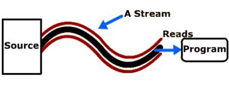
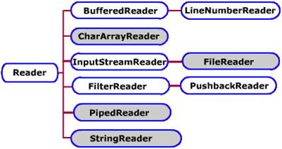

# Magatzems i fluxos de dades
En la primera part de la UF vam veure en Java (en el paquet java.io) que hi ha diferents classes que faciliten treballar amb fitxers des de diferents perspectives:

* Fitxers d'accés seqüencial o accés aleatori,
* Fitxers de caràcters o fitxers de bytes (binaris).

Els dos primers són una classificació segons el tipus de contingut que guarden. Els dos últims són classificats segons la manera d'accés.

Abans d'aprofundir en aquest tema cal clarificar el concepte de fitxers com a magatzems de contingut, i el concepte de contingut com a flux de dades.

## Els fitxers

Des del punt de vista de l’usuari, els fitxers són magatzems permanents d'informació guardada en forma de dades estructurades i ben organitzades de manera que la seva identificació i conseqüent interpretació siguin fàcils. Aquesta és una perspectiva centrada en la representació mental de la informació i s’anomena estructura lògica.

L'estructura lògica o representació conceptual de les dades va canviant a mida que avança pels diferents nivells d'abstracció fins a arribar al dispositiu d'emmagatzematge. La forma final de les dades es coneix també com estructura física. Ara bé, en el camí de la persistència, la representació mental original passarà per diferents nivells d'abstracció fins arribar a l’emmagatzematge físic(figura anterior).

Cada nivell imposarà les seves limitacions a la representació del nivell anterior introduint canvis que alteraran l'estructura original.

El primer nivell d'abstracció el trobem en el llenguatge de programació utilitzat, que depenent de les estructures d'informació suportades, els tipus de dades permesos, la representació en memòria d'aquest, etc., alterarà en alguna mesura la representació de partida.

El Sistema Operatiu imposarà també les seves restriccions i ho farà també el driver o adaptador al sistema d'emmagatzematge, o els mecanismes físics i els suport escollits en últim terme.

L’estructura final, com les dades acaben emmagatzemant-se, s’anomena també estructura física.

## Seriació

Les referències a memòria són dades transitòries que varien en cada execució. Si guardéssim de forma persistent les referències a memòria, en recuperar-les obtindríem dades totalment incoherents perquè apuntarien a dades inexistents o ocupades per altra informació.

Si volem un emmagatzematge i una recuperació de les dades eficaç, caldrà assegurar que totes les dades referenciades s’emmagatzemen també al fitxer i es relacionen entre elles de forma que sigui factible
localitzar-les i recuperar-les conjuntament.

La forma més senzilla de fer-ho consisteix a compactar les successives dades referenciades agrupant-les, una darrera l’altra, en una única seqüència de dades primitives lliure de referències.

Aquest procés s’anomena seriació i cal utilitzar-lo per transformar estructures complexes de la memòria principal en sèries de dades compactes i fàcilment emmagatzemables.

## Flux de dades

En Java, l'accés a fitxers és tractat com un flux d'informació entre el programa i el fitxer. Un flux no és més que un objecte que fa d'intermediari entre el programa i l'origen o la destinació de la informació.

Aquesta abstracció proporcionada pels fluxos fa que els programadors, quan volen accedir a informació, només s'hagin de preocupar per treballar amb els objectes que proporcionen el flux, sense importar l'origen o la destinació concreta d'on vinguin o vagin les dades.

Qualsevol programa que hagi de obtenir informació de qualsevol font necessita obrir un stream, igualment si necessita enviar informació obrirà un stream i s'escriurà la informació. La vinculació d'aquest stream amb el dispositiu físic la fa el sistema d'entrada / sortida de Java.

## Conceptes bàsics sobre fitxers seqüencials

Començarem veient les operacions sobre fitxers seqüencials i després treballarem amb els aleatoris.

En els primers veurem les classes per la gestió dels fluxos de dades, primer en el cas dels fluxos binaris i després en el cas dels fluxos de caràcters.

* Accés seqüencial: les dades o registres es llegeixen i s'escriuen en ordre. Si es vol accedir a una dada cal llegir abans tots els anteriors. L'escriptura de dades es fa a partir de l'última dada escrita, no és
possible fer insercions entre les dades que ja hi existeixen.

Operacions bàsiques sobre fitxers:

* Creació del fitxer.
* Obertura del fitxer.
* Tancament del fitxer.
* Lectura de les dades del fitxer.
* Escriptura de les dades en el fitxer.

En els fitxers seqüencials els registres s'insereixen en ordre cronològic. Si cal afegir nous registres aquests s'afegeixen a partir final del fitxer:

* Consultes: Per consultar un determinat registre és necessari començar la lectura des del primer registre, i continuar llegint seqüencialment fins a localitzar el registre buscat.

* Altes: les altes es realitzen al final de l'últim registre inserit, només es permet afegir dades al final del fitxer.

* Baixes: per donar de baixa un registre cal fer ús d'un fitxer auxiliar, llegint tots els registres i copiar tots a excepció del que vulguem donar de baixa. Finalment cal canviar el nom del fitxer auxiliar donant-li el nom del fitxer original.

* Modificacions: El procés de modificacions és similar al de baixes

### Creating a File

If you want to create a new file, you must use a class that is equipped to write values to a file. To do this, you can use the PrintWriter class. The PrintWriter class is defined in the java.io package. Therefore, if you want to use it, you can import it in your document. This would be done as follows:

```java
import java.io.PrintWriter;

public class Exercise {
    public static void main(String[] args)  throws Exception {

    }
}
```

The PrintWriter class is based on (implements) the Writer class. The class is equipped with the necessary means of writing values to a file.

Before using the class, declare a variable for it. This class is equipped with many constructors. One of the constructors takes as argument an OutputStream object. We saw that the File class is based on OutputStream. This means that you can pass a File object to a PrintWriter constructor. This would be done as follows:

```java
import java.io.File;
import java.io.PrintWriter;

public class Exercise {
  public static void main(String[] args)  throws Exception {
  	// Indicate that you are planning to use a file
  	File fleExample = new File("Example.xpl");
    // Create that file and prepare to write some values to it
    PrintWriter pwInput = new PrintWriter(fleExample);
  }
}
```

## Writing to a File

After creating a PrintWriter object, you can write values to the file. To support this, the PrintWriter class is equipped with the print() and println() methods that is overloaded with various versions for each type of values (boolean, char, char[], int, float, double, String, or Object). Therefore, to write a value to a file, call the appropriate version of the PrintWriter.print() method and pass the desired value. Here are examples:

```java
import java.io.File;
import java.io.PrintWriter;

public class Exercise {
  public static void main(String[] args)  throws Exception {
    // Indicate that you are planning to use a file
    File fleExample = new File("Example.xpl");
    // Create that file and prepare to write some values to it
    PrintWriter pwInput = new PrintWriter(fleExample);

    // Write a string to the file
    pwInput.println("Francine");
    // Write a string to the file
    pwInput.println("Mukoko");
    // Write a double-precision number to the file
    pwInput.println(22.85);
    // Write a Boolean value to the file
    pwInput.print(true);
  }
}
```

After using a PrintWriter object, you should free the resources it was using. To assist you with this, the PrintWriter class is equipped with the Close() method. Here is an example of calling:

```java
import java.io.File;
import java.io.PrintWriter;

public class Exercise {
  public static void main(String[] args)  throws Exception {
    // Indicate that you are planning to use a file
    File fleExample = new File("Example.xpl");
    // Create that file and prepare to write some values to it
    PrintWriter pwInput = new PrintWriter(fleExample);

    // Write a string to the file
    pwInput.println("Francine");
    // Write a string to the file
    pwInput.println("Mukoko");
    // Write a double-precision number to the file
    pwInput.println(22.85);
    // Write a Boolean value to the file
    pwInput.print(true);
    // After using the PrintWriter object, de-allocated its memory
    pwInput.close();
    // For convenience, let the user know that the file has been created
    System.out.println("The file has been created.");   
  }
}
```

### Opening a File

Besides creating a file, the second most common operation performed on a file consists of opening one. You can open a file using the File class. As done previously, first declare a File variable and pass the name of the file to its constructor. Here is an example:

```java
import java.io.File;

public class Exercise {
  public static void main(String[] args)  throws Exception {
    // Incidate that you are planning to opena file
	  File fleExample = new File("Example.xpl");
  }
}
```

### Exercicis

#### Exercici 1
Implementa la classe `NumsToFile1.java` que escriu els números de `1100 a 1200` en un arxiu que amb nom `Num11001200.txt` a l'escriptori.

#### Exercici 2
Implementa la classe `CharsToFile1.java` que escrigui les lletres de `a` a `z` (una en cada línia i en minúscules) en un arxiu que hem anomenat `alphabeta.txt` a l'escriptori.

#### Exercici 3
Implementa la classe `CharsFileToScreen1.java` Llegir l'arxiu de l'exercici 2 i escriure en pantalla els caràcters un al costat de l'altre i en majúscules amb un espai entre cada caràcter.

#### Exercici 4
Implementa la classe `TreballadorsToFile1.java` . Cal que llegeixi valors des de consola `(Nom, Cognoms, Salari,  Casat)` de tants treballadors fins que en respondre a la pregunta `Vols Continuar?` la seva resposta sigui diferent a `Y`. Aquestes dades s'hauran d'emmagatzemar en un fitxer anomenat `treballadors.txt`. En aquest arxiu en cada fila s'emmagatzemarà un registre amb els valors separats per comes, amb tants registres com els que s'han introduït per consola.

#### Exercici 5
Implementa la classe `TreballadorsToScreen1.java`. Cal que llegeixi valors del fitxer `treballadors.txt` i mostri el resultat amb el següent format exemple:

```console
TREBALLADOR 1

Gerard

Paulino

1500

false

TREBALLADOR 2

.....

```

## Java Streams
The terms "input" and "output" can sometimes be a bit confusing. The input of one part of an application is often the output of another. Is an OutputStream a stream where output is written to, or output comes out from (for you to read)? After all, an InputStream outputs its data to the reading program, doesn't it? Personally, I found this a bit confusing back in the day when I first started out learning about Java IO.

In an attempt to clear out this possible confusion, I have tried to put some different names on input and output to try to link them conceptually to where the input comes from, and where the output goes.

Java's IO package mostly concerns itself with the reading of raw data from a source and writing of raw data to a destination. The most typical sources and destinations of data are these:

* Files
* Pipes
* Network Connections
* In-memory Buffers (e.g. arrays)
* System.in, System.out, System.error

The diagram below illustrates the principle of a program reading data from a source and writing it to some destination:


## Streams

IO Streams are a core concept in Java IO. A stream is a conceptually endless flow of data. You can either read from a stream or write to a stream. A stream is connected to a data source or a data destination. Streams in Java IO can be either byte based (reading and writing bytes) or character based (reading and writing characters).

A stream is a path travelled by data in a program. To bring in information a program opens a stream on an information source (a file, memory, a socket) and reads the information serially.

Similarly a program can send information to an external destination by opening a stream to a destination and writing the information out serially.

Depending upon the direction of the data, streams are classified into TWO categories:

* Input Streams
* Output Streams

Input Streams: Bringing Information in. To bring in information, open a stream on an information source (a file, memory, or socket) and read the information serially.



Output Stream: Sending Information Out. A program can send information to an external destination by opening a stream to a destination and writing the information out serially.


## The InputStream, OutputStream, Reader and Writer

A program that needs to read data from some source needs an InputStream or a Reader. A program that needs to write data to some destination needs an OutputStream or a Writer. This is also illustrated in the diagram below:


An InputStream or Reader is linked to a source of data. An OutputStream or Writer is linked to a destination of data.

## Stream classification

Depending upon data type on which they operate, Java streams are classified into 2 categories:


The java.io package contains a large number of stream classes that provide capabilities for processing all types of data.     These classes may be categorized into two groups based on the data type on which they operate.

* Byte Stream Classes: Byte Stream Classes are classes that provide support for handling i/o operations on bytes.
* Character Stream Classes: Character Stream Classes are classes that provide support for managing i/o operations on characters.

### Java IO Purposes and Features

Java IO contains many subclasses of the InputStream, OutputStream, Reader and Writer classes. The reason is, that all of these subclasses are addressing various different purposes. That is why there are so many different classes. The purposes addressed are summarized below:

* File Access
* Network Access
* Internal Memory Buffer Access
* Inter-Thread Communication (Pipes)
* Buffering
* Filtering
* Parsing
* Reading and Writing Text (Readers / Writers)
* Reading and Writing Primitive Data (long, int etc.)
* Reading and Writing Objects

These purposes are nice to know about when reading through the Java IO classes. They make it somewhat easier to understand what the classes are targeting.

## Java IO Class Overview Table

Having discussed sources, destinations, input, output and the various IO purposes targeted by the Java IO classes, here is a table listing most (if not all) Java IO classes divided by input, output, being byte based or character based, and any more specific purpose they may be addressing, like buffering, parsing etc.

(FALTA LA TABLA)

## Using a Stream

1. Import the package java.io , which contains a collection of stream classes.
2. Create an object of input/output stream that is associated with the data source / destination.
3. Read/write data using this object's read/ write methods.
4. Finally close the stream by calling its close() method.

# Standard Streams

All the programming languages provide support for standard I/O where user's program can take input from a keyboard and then produce output on the computer screen. If you are aware if C or C++ programming languages, then you must be aware of three standard devices STDIN, STDOUT and STDERR. Similar way Java provides following three standard streams

* Standard Input: This is used to feed the data to user's program and usually a keyboard is used as standard input stream and represented as System.in.

* Standard Output: This is used to output the data produced by the user's program and usually a computer screen is used to standard output stream and represented as System.out.

* Standard Error: This is used to output the error data produced by the user's program and usually a computer screen is used to standard error stream and represented as System.err.

 The 3 streams System.in, System.out, and System.err are also common sources or destinations of data. Most commonly used is probably System.out for writing output to the console from console programs.

These 3 streams are initialized by the Java runtime when a JVM starts up, so you don't have to instantiate any streams yourself (although you can exchange them at runtime).

`System.in` is an `InputStream` which is typically connected to keyboard input of console programs. `System.in` is not used as often since data is commonly passed to a command line Java application via command line arguments, or configuration files. In applications with GUI the input to the application is given via the GUI. This is a separate input mechanism from Java IO.

`System.out` is a `PrintStream`. `System.out` normally outputs the data you write to it to the console. This is often used from console-only programs like command line tools. This is also often used to print debug statements of from a program (though it may arguably not be the best way to get debug info out of a program).

`System.err` is a `PrintStream`. `System.err` works like System.out except it is normally only used to output error texts. Some programs (like Eclipse) will show the output to System.err in red text, to make it more obvious that it is error text.

Simple `System.out` + `System.err` example: Here is a simple example that uses `System.out` and `System.err`:

```java
try {
  InputStream input = new FileInputStream("c:\\data\\...");
  System.out.println("File opened...");

} catch (IOException e){
  System.err.println("File opening failed:");
  e.printStackTrace();
}
```

Following is a simple program which creates `InputStreamReader` to read standard input stream until the user types a `q`:

```java
import java.io.*;

public class ReadConsole {
  public static void main(String[] args) {
    InputStreamReader cin = null;

    try {
      cin = new InputStreamReader(System.in);
      System.out.println("Enter characters, 'q' to quit.");
      char c;
      do {
        c = (char) cin.read();
        System.out.print(c);
      } while (c != 'q');
    } finally {
      if (cin != null) {
        cin.close();
      }
    }
  }
}
```

Let's keep above code in `ReadConsole.java` file and try to compile and execute it as below. This program continues reading and outputting same character until we press `q`:

# Character Stream Classes


Character stream classes can be used to read and write 16 bit Unicode characters.

* `Reader Stream class`: Used to read characters from file. These are functionally same as InputStream classes but these read characters instead of bytes.
* `Writer Stream class`: Used to write characters to file. These are functionally same as OutputStream classes but these write characters instead of bytes.


## Reading/Writing Characters

The Reader and Writer implement the streams that can handle characters. The two subclasses used for handling characters in files are FileReader and FileWriter.




### Character Strings

Character strings are used to work with any text that is represented by ASCII value set or Unicode. Examples of files you can work with through a character stream are plain text files, html documents and java source files. The classes used to read and write these streams are subclasses of readers and writers. These should be used for all text input instead of dealing directly with file streams.


### Reading Text Files

#### FileReader Stream

FileReader is the main class used when reading character streams from a file. This class inherits from InputStreamReader, which reads a file stream and converts the byte in integer value that represents Unicode characters. In the program given below the FileReader character stream is nested with BufferedReader stream because with character stream you can read one character at a time. But with BufferedReader you can read a line of text at a time using its ReadLine() method.

#### Example:

```java
package net.xeill.elpuig;

import java.io.*;

public class ReadCharFile {

  public static void main(String[] args) {

    try {

      FileReader file = new FileReader("ReadCharFile.java");
      BufferedReader inputStream = new BufferedReader(file);

      boolean eof = false;

      while (!eof) {
        String line = inputStream.readLine();
        if (line == null) eof = true;
        else System.out.println(line);
      }
      inputStream.close();

    } catch (Exception e) {
      System.out.println(e.getMessage());
    }
  }
}
```

## Writing Text Files

### FileWriter Stream

The `FileWriter` class is used to write character streams to a file. It is a subclass of `OutputStreamWriter` which has a behavior to convert Unicode character codes to bytes.

There are two `FileWriter` constructors. They are `FileWriter (String)` and `FileWriter (String, Boolean)`. The string indicates the name of the file that the character string will be directed into which can include a folders path also. The optional boolean argument should be equal to true if the file is to be appended to a existing text file.

```java
import java.io.*;

public class GenerateCharToFile {

  public static void main(String[] args) throws IOException {
    File abc = new File(System.getProperty("user.dir")+File.separator+"alphabeta5465.txt");
    FileWriter fw = new FileWriter(abc);
    try (BufferedWriter bfw = new BufferedWriter(fw)) {
      for (char c = 'a'; c <= 'z'; c++) {
        bfw .write(c+"\n");
      }
      bfw.close();
    } catch(Exception e) {

    }
  }
}
```
Next use the `FileWriter (String, Boolean)` constructor and run it.

This example shows how to write a `String Array` into a file.

```java
package net.xeill.elpuig;

import java.io.BufferedWriter;
import java.io.File;
import java.io.FileWriter;

public class ArrayToFile {
  public static void main(String[] args) {
    String[] text = {"Angel", "Estel", "Ona"};

    try {
      FileWriter fw = new FileWriter(System.getProperty("user.dir") + File.separator + "noms.txt", false);
      BufferedWriter bw = new BufferedWriter(fw);

      for (String t : text) {
        bw.write(t);
        bw.newLine();
      }
      bw.close();

    } catch (Exception e) {
      e.printStackTrace();
    }
  }
}
```

# Exercicis FileReader i FileWriter

#### Exercici 6

Implementa la classe FileReaderAlpha.java que llegeixi l'arxiu de alphabeta5465.txt i escriure en pantalla els caràcters un al costat (en majúscules) de l'altre amb un espai entre cada caràcter.

#### Exercici 7

Implementa la classe `CharsFileReader.java` que llegeixi caràcter a caràcter el contingut d'un fitxer de text donat.
ue escrigui les lletres de `a` a `z` (una en cada línia i en minúscules) en un arxiu que hem anomenat `alphabeta.txt` a l'escriptori.

#### Exercici 8

Implementa la classe `CopyFilesFRFW.java` que copii un fitxer de text donat en un altre especificat emprant les classes `FileReader` i `FileWriter`.

#### Exercici 9
Implementa la classe `CopyDirFRFW.java` que copii els fitxers continguts en un directori donat en un altre especificat emprant les classes `FileReader` i `FileWriter`.

#### Exercici 10
Implementa la classe `CopyArrayToFile.java` que rebi un array de paraules i una ruta a un arxiu, guardi a l'arxiu una paraula sota l'altra. Després ensenyar el contingut de l'arxiu per pantalla. Cal fer-ho en dos mètodes, un per guardar en l'arxiu i un altre per ensenyar per pantalla.

#### Exercici 11
Implementa la classe `ComptaVocals.java` que en llegir un fitxer de text, generi un fitxer csv on la primera fila sigui `a,e,i,o,u` i totes les files següents representin el nombre d'ocurrències de cada vocal en cada línia del fitxer de lectura.

#### Exercici 12
Implementa la classe `RecordsTextToCSV.java` que en llegir un fitxer de text tal i com es mostra a l'exemple:

```console
Mihaita
Minca
21
****
Daniel
Barrueco
19
****
Ferran
Boutin
19
```

Generi un fitxer csv on la primera fila sigui nom, cognoms, edat i les següents les ocurrències que apareixen en el fitxer de lectura. Presuposem l'ús de 3 arrays String[] per tal d'emmagatzemar temporalment les ocurrències apareguides després de la lectura. Posteriorment es llegiran aquests tres arrays i s'enregisrarà el seu contingut en el fitxer csv de sortida. Es demana implementar tres mètodes. `llegeixFitxer()`, `mostraPerPantalla()` i `escriuSortidaCSV()`

#### Exercici 13
Implementa la classe `CSVToScreen.java` que en llegir un fitxer csv on els diferents camps es defineixen en la primera fila: firtname, lastname, username, password, email.

La sortida generada pel programa serà semblant a la següent:

```console
Persona 1
firtname: Joan Anton
lastname: Pérez Braña
username: joan
password: Noteolvid3$
email: joan@iespuigcastellar.xeill.net
****
Persona 2
....
```

Cal tenir en compte que les columnes poden permutar i la sortida caldria que fos igual de coherent. Per això es decideix emmagatzemar els valors de la primera fila d'entrada en un array `String[]`.
